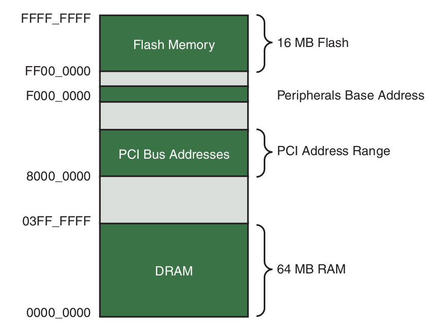

# Chapter 2: The Big Picture

## Characteristics of an Embedded System

- contains a processing engine, such as a general-purpose microprocessor
- typically designed for a specific application or purpose
- simple (or no) user interface
- resource-limited
- power limitations
- not used as a general-purpose computing platform
- has application software built in
- ships with all intended application hardware and software preintegrated
- intended for applications without human intervention

### BIOS vs Bootloader

BIOS:

- takes control over the processor when power is first applied
- stored in flash memory
- complex set of sytem-configuration software routines that have knowledge of
low-level details of hardware architecture
- for desktop computer
- primary responsibility: initialize hardware + load OS from hard drive

Bootloader:

- similar to BIOS for embedded systems
- bootloader is specific to hardware board
- primary responsiblity: initializes critical hardware components & system memory,
allocates system resources, locates and loads the OS image, pass control to OS
- custom-designed platform -> bootloader function must be supplied by system designer
- commercial off-the-shelf (COTS) platform -> bootloader included on the board

## Anatomy of Embedded System

- processor
- flash memory: nonvolatile program and data storage
- main memory: SDRAM (megabyte range)
- real-time clock module backed by battery: keeps time of day (wall clock)
- ethernet and USB interface
- UART for serial interface: console output
- 802.11 chipset: wireless functions
- System-on-Chip (SOC): integrated peripherals

### Typical Embedded Linux Setup

- development system (host): desktop Linux distribution, contains development
tools + toolchaina
- target platform
- target connected to host through RS-232 cable for console: minicom, picocom, screen
- target connected to host through Ethernet cable for network connection for TFTP
loading

Boot Process:

- power up
- bootloader (e.g. U-Boot) initializes hardware
- bootloader loads kernel and device tree through TFTP
- kernel takes over (in kernel context), e.g. internal initialization, mounts root filesystem
- kernel start init (in user context)

## Storage Considerations

### Flash Memory

- non-volatile storage type in embedded devices
- no rotational parts
- flash write and erase times is considerably longer than rotational hard drive
technology
- flash memory is divided into large erasable units (erase blocks)

NOR Flash
- 1 to 0 with address
- 0 to 1 -> entire erase block must be erased
- for writes, entire erase block must be erased to write 1 byte -> large write
times
- cell write lifetime: limited number of write cycles before failure

NAND Flash
- smaller block sizes -> faster and more efficient writes

Flash usage
- raw binary data (perhaps) compressed is stored on flash device
- upon bootup, file system image stored in flash is read into a Linux ramdisk
block device, mounted as filesystem and accessed from RAM
- flash structure: bootloader + configuration, Linux kernel, ramdisk/filesystem
image, upgrade space

Flash file system
- Wear-leveling = distribute writes evenly over the physical erase blocks of the
flash memory in order to extend the life of the flash memory chip
- JFFS2 (Journaling Flash File system 2) -> journaling to recover data in case
of crash

### Memory Space

System Memory Map:

 

- Memory Management Unit (MMU): controls access rights and memory translation
- first things are to configure hardware MMU on processor and data structures,
e.g. page table -> virtual memory space
- threads executing in kernel: kernel space context
- applications execute in user space context -> needs to access kernel system
calls to access privileged resources, e.g. file/device I/O
- application does read request -> read() function in C lib -> context switch
from user's program to the kernel -> hard drive access with driver -> return
to user space through hardware interrupt
- swapping is often disabled on embedded memory systems

