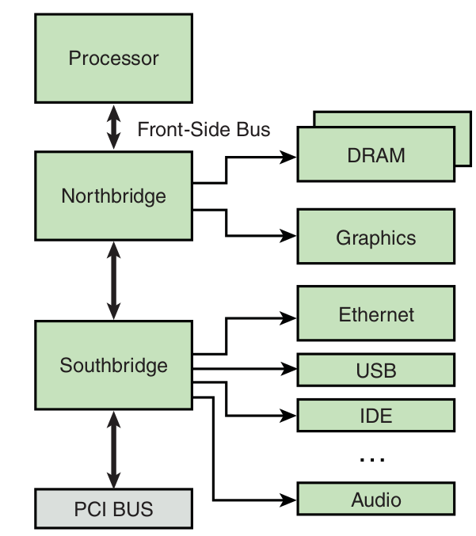

# Chapter 3: Processor Basics

- Linux is best used with a processor that contains an MMU

## Stand-Alone Processors

- require additional support circuitry for their basic operation -> additional
chipset surrounding processor, e.g. external peripherals
- often high CPU performance
- Examples: IA32/64, Power Architecture -> Intel (Pentium/Atom), IBM, Freescale

### Companion Chipsets

- stand-alone processors require support logic to connect to and enable external
peripheral devices such as main system memory (DRAM), ROM or Flash memory,
system buses such as PCI, and other peripherals, such as keyboard controllers,
serial ports, IDE interfaces
- Typical structure:

- northbridge chip is connected to high-speed front-side bus (FSB): for graphics
and DRAM
- southbridge chip: provides I/O (Ethernet, USB, IDE, Audio, keyboard, mouse)
and PCI bus connectivity
- manufacturers of chipsets: VIA Technologies, Marvell, Tundra, nVidia, Intel

## Integrated Processors: Systems-on-Chip (SOC)

- integrate peripherals into one chipset
- Examples: Power Architecture, MIPS, ARM, IA32/64

## Hardware Platforms

- move away from proprietary hardware and software platforms and toward
commercial off-the-shelf (COTS) solutions
- Examples: cPCI, ATCA

