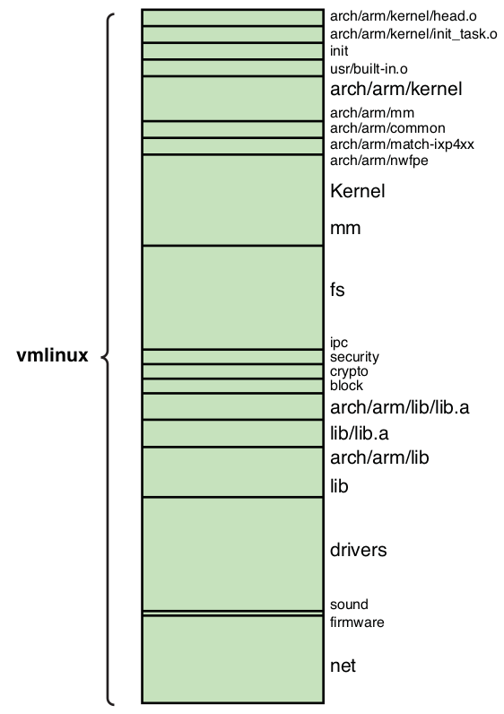

# Chapter 4: The Linux Kernel - A Different Perspective

## Background

- Linus Torvalds wrote original version of Linux in 1991

### Kernel Versioning

- Versioning: Linux \<major-number\>.\<minor-number\>.\<sequence-number\>
- if minor version is even -> production kernel
- if minor version is odd  -> development kernel

Kernel version can be seen in top-level `Makefile`:
- `VERSION` = major number
- `PATCHLEVEL` = minor number
- `SUBLEVEL` = sequence number
- `KERNELVERSION` and `KERNELRELEASE` used in several places in the build system
- `KERNELRELEASE` accessible through `/proc/version`
- `EXTRAVERSION` to keep track of the kernel version in personal kernel project

## Linux Kernel Construction

### Top-Level Source Directory

- Top-Level Source Directory is in `/usr/src/linux-x.y.z`
- Important subdirectories:
```bash
arch/
block/
crypto/
Documentation/
drivers/
firmware/
fs/
include/
init/
ipc/
kernel/
lib/
mm/
net/
samples/
scripts/
security/
sound/
usr/
virt/
```
- largest branches are `.../drivers` and `.../arch`
- other important files in top-level source directory: `Makefile`,`dot-config`
(hidden file)

### Compiling the kernel

- two common build outputs: `System.map`, `vmlinux`
- `System.map`:
    * contains human-readable list of the kernel symbols and their respective address
    * helpful for kernel debug
- `vmlinux`:
    * architecture-specific ELF file in executable format
    * produced by top-level kernel makefile
    * is never booted directly
- first step: prepare the kernel source tree for specific architecture:
```bash
make ARCH=<architecture-name> CROSS_COMPILE=<toolchain> <board-name>_defconfig
```
- command above builds default configuration (the `dot-config` file) that drives
the kernel build, based on defaults found in `<board-name>_defconfig` file (found
in `.../arch`
- second step: compile/build the actual kernel image:
```bash
make ARCH=<architecture-name> CROSS_COMPILE=<toolchain-name> zImage
```
- `CROSS_COMPILE` is prepended to `CC`,`LD`,`AR`
- `zImage` is a target in the top-level `Makefile`
- verbose output through `V=1`

### The Kernel Proper: `vmlinux`

- fully stand-alone, monolithic ELF image -> contains no unresolved external
references
- `vmlinux.lds`: linker script, detailed recipe for how the kernel binary image
should be linked
- different object modules that form the resulting binary image:
    * `head.o`: assembled from `.../arch/.../head.S` -> very low-level kernel
    initialization
    * `init_task.o`: sets up initial thread and task structures that the kernel
    requires
    * various `built-in.o` object modules: each of these object modules comes
    from specific part of the kernel source tree
- `vmlinux` image components: contains a section for each line of the link stage

- `vmlinux` image components:

| Component | Description |
| ----------- | ----------- |
| `arch/arm/kernel/head.o` | Kernel-architecture-specific startup code. |
| `arch/arm/kernel/init_task.o` | Initial thread and task structs required by the kernel. |
| `init/built-in.o` | Main kernel initialization code. |
| `usr/built-in.o` | Built-in initramfs image. |
| `arch/arm/kernel/built-in.o` | Architecture-specific kernel code. |
| `arch/arm/mm/built-in.o` | Architecture-specific memory-management code. |
| `arch/arm/common/built-in.o` | Architecture-specific generic code. Varies by architecture. |
| `arch/arm/mach-ixp4xx/built-in.o` | Machine-specific code, usually initialization. |
| `arch/arm/nwfpe/built-in.o` | Architecture-specific floating-point emulation code. |
| `kernel/built-in.o` | Common components of the kernel itself. |
| `mm/built-in.o` | Common components of memory-management code. |
| `fs/built-in.o` | File system code. |
| `ipc/built-in.o` | Interprocess communications, such as SysV IPC. |
| `security/built-in.o` | Linux security components. |
| `crypto/built-in.o` | Cryptographic API. |
| `block/built-in.o` | Kernel block layer core code. |
| `arch/arm/lib/lib.a` | Architecture-specific common facilities. Varies by architecture. |
| `lib/lib.a` | Common kernel helper functions. |
| `arch/arm/lib/built-in.o` | Architecture-specific helper routines. |
| `lib/built-in.o` | Common library functions. |
| `drivers/built-in.o` | All the built-in drivers. Does not include loadable modules. |
| `sound/built-in.o` | Sound drivers. |
| `firmware/built-in.o` | Driver firmware objects. |
| `net/built-in.o` | Linux networking. |
| `.tmp_kallsyms2.o` | Kernel Symbol table. |

- `vmlinux`:
    * kernel proper
    * never booted directly, image must be compressed

## Kernel Build System

### The `Dot-Config`

- configuration blueprint for building a Linux kernel image
- output of configuration is written to configuration file name `.config`, located
in top-level source directory -> drives the kernel build
- `make distclean` or `make proper` delete `.config` file -> need backup
- hidden file
- options are `CONFIG_<subsystem-name>_<option-name>=<option>`
- the entire kernel is compiled and linked as a single statically linked
executable
- common device drivers are usually loadable modules -> can be incrementally
linked at runtime
- `=m` to declare dynamically loadable module
- `=y` to statically link as part of the kernel image -> would end up in `.../drivers/built-in.o`

### Configuration Editors

- saved changes are written to the `.config` file that drives the kernel build
via the top-level `Makefile`

Configuration targets in `Makefile`:

- `config`: update current config using a line-oriented program
- `menuconfig`: update current config using a menu-based program
- `xconfig`: update current config using a QT-based front end
- `gconfig`: update current config using a GTK-based front end
- `oldconfig`: update current config using a provided `.config` as the base
- `silentoldconfig`: same as oldconfig but silently
- `randconfig`: new config with random answer to all options
- `defconfig`: new config with default answer to all options
- `allmodconfig`: new config that selects modules, when possible
- `allyesconfig`: new config in which all options are accepted with yes
- `allnoconfig`: new minimal config

Most software modules read the configuration indirectly via the `.config` file
as follows:
- `.config` file is processed into C header file found in `.../include/linux`
directory, called `autoconf.h`
- `autoconf.h` is generated automatically
- never edit it directly, because it is replaced every time a new build starts

### Makefile Targets

- `make help`: presented with list of targets
- if no targets: generates the kernel ELF file `vmlinux` + default binary image
for chosen architecture (e.g. `bzImage`) + build all device driver modules specified
by configuration
- `zImage`: architecture-specific target, default target image that can be loaded
and run on target embedded system
- `bzImage`: specific to x86/PC architecture, not bzip2-compressed, but big
`zImage` -> only suitable for PC architecture with BIOS
- `*_defconfig`: default configurations for specific board, used to preconfigure
the Linux kernel

## Kernel Configuration

- important files are `Kconfig` and `Makefile`
- `Kconfig`: drives the configuration process for features contained within its
subdirectory
- contents of `Kconfig` are parsed by the configuration subsystem, which presents
configuration choices to the user and contains help text associated with a given
parameter
- configuration utility (e.g. `gconf`) read the `Kconfig` files starting from
the `arch` subdirectory's `Kconfig` file -> invoked from the `Kconfig` makefile
- `Kconfig` reads more `Kconfig` files with `source "<path-to-file>/Kconfig"`
- all `Kconfig` files together determine the complete set of menu options
presented to the user when configuring the kernel -> configuration utility
recursively reads the `Kconfig` file chain and builds the configuration menu
structure

### Kernel Makefiles

- when building the kernel, the makefiles scan the configuration and decide what
subdirectories to descend into and what source files to compile for a given
configuration
- use `CONFIG_*` options from `.config`/`autoconf.h` to select build-specific
options in `Makefile` to customize your build

## Kernel Documentation

- Documentation can be found in `.../Documentation`
- due to rapid pace of kernel development, Documentation files might get outdated
quickly
- still great way to get an overview of different subsystems and kernel concepts

## What else do you need?

Apart from the Linux kernel itself, you need the following components to develop,
test, and launch your embedded Linux widget:
- a bootloader ported to and configured for your specific hardware platform
- a cross-compiler and associated toolchain for your chosen architecture
- a file system containing many packages - binary executables and libraries
compiled for your native hardware architecture/processor
- device drivers for any custom devices on your board
- a development environment, including host tools and utilities
- a Linux kernel source tree enabled for your particular processor and board

