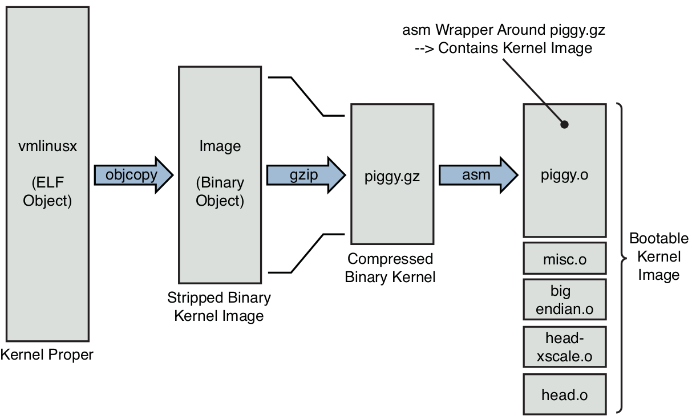
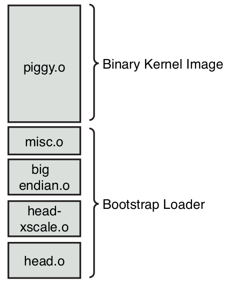
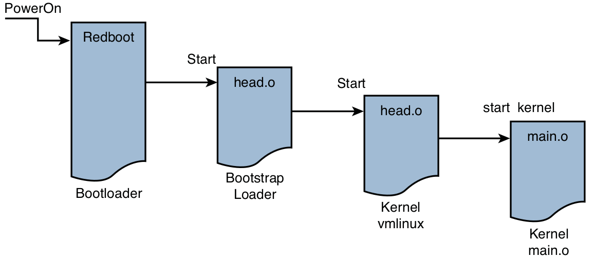

# Chapter 5: Kernel Initialization

## Composite Kernel Image

- `vmlinux`: kernel proper, monolithic kernel itself
- `head.S`: first line of code

Final Kernel Build Sequence:

```bash
LD      vmlinux
SYSMAP  System.map
SYSMAP  .tmp_System.map
OBJCOPY arch/arm/boot/Image
Kernel: arch/arm/boot/Image is ready
AS      arch/arm/boot/compressed/head.o
GZIP    arch/arm/boot/compressed/piggy.gz
AS      arch/arm/boot/compressed/piggy.o
CC      arch/arm/boot/compressed/misc.o
AS      arch/arm/boot/compressed/head-<mach-name>.o
AS      arch/arm/boot/compressed/big-endian.o
LD      arch/arm/boot/compressed/vmlinux
OBJCOPY arch/arm/boot/zImage
Kernel: arch/arm/boot/zImage is ready
```

ARM Low-Level Architecture Objects:

| Component | Description |
| ----------- | ----------- |
| `vmlinux` | Kernel proper, in ELF format, including symbols, comments, debug info (if compiled with `g`), and architecture-generic components. |
| `System.map` | Text-based kernel symbol table for the `vmlinux` module. |
| `.tmp System.map` | Generated only to sanity-check `System.map` ; otherwise, not used in the final build image. |
| `Image` | Binary kernel module, stripped of symbols, notes, and comments. |
| `head.o` | ARM-specific startup code generic to ARM processors. This object is passed control by the bootloader. |
| `piggy.gz` | The file `Image` compressed with `gzip`. |
| `piggy.o` | The file `piggy.gz` in assembly language format so that it can be linked with a subsequent object, `misc.o`. |
| `misc.o` | Routines used to decompress the kernel image (`piggy.gz`) and the source of the familiar boot message `Uncompressing Linux...` done on some architectures. |
| `head-<mach-name>.o` | Processor initialization specific to machine family. |
| `big-endian.o` | Tiny assembly language routine to switch the machine-specific processor into big-endian mode. |
| `vmlinux` | Composite kernel image. This is an unfortunate choice of names, because it duplicates the name for the kernel proper; the two are not the same. This binary image is the result when the kernel proper is linked with the objects in this table. |
| `zImage` | Final composite kernel image loaded by bootloader. |

Composite Kernel Image Construction:



### The `Image` Object

- the binary kernel image
- `objcopy` tool to convert `vmlinux` ELF file to `Image` binary file
- `-O`: converts the `vmlinux` file from ELF to binary format
- `-R`: removes redundant ELF sections `.note`, `.note.gnu.build-id`, `.comment`
- `-S`: strip debugging symbols

### Architecture Objects

- architecture-specific modules: `head.o`, `head-<machine-name>.o`
- perform low-level architecture and processor-specific tasks
- `Image` file is compressed using the `gzip` command to create `piggy.gz`, i.e.
a compressed version of `Image`
- `piggy.S` is assembled, which contains a reference to the compressed `piggy.gz`
- the binary kernel image is being piggybacked as payload into a low-level
assembly language `bootstrap loader`
- bootloader = first-stage bootloader
- boostrap loader = second-stage bootloader
- task of bootstrap loader: initializes the processor and required memory regions,
decompresses the binary kernel image, and loads it into the proper place in system
memory before passing control to it

### Bootstrap Loader

- boostrap loader = second-stage bootloader
- loads the Linux kernel image into memory
- typical tasks:
    * perform checksum verification of kernel image
    * provide a proper context for the kernel to run in
    * decompress the kernel image
    * relocate the kernel image
- bootloader: controls the board upon power-up and does not rely on the Linux
kernel in any way
- bootstrap loader: the glue between a bare metal bootloader and the Linux kernel
- bootstrap loader is concatenated to the kernel image for loading:



Tasks of depicted bootstrap loader:
- low-level assembly language processor initialization, e.g. enabling the
processor's internal instruction and data cache, disabling interrupts, and
setting up a C runtime environment -> `head.o`,`head-xscale.o`
- decompression and relocation code -> `misc.o`
- other processor-specific initialization -> `big-endian.o`

### Boot Messages

- `kernel version string` is output during startup with the following information:
    * kernel version
    * username/machine name where the kernel was compiled
    * toolchain info
    * build number
    * date and time the kernel image was compiled
- `kernel command line`

## Initialization Flow of Control

- bootloader kicks in right after power-up:
    * resides in system nonvolatile memory (Flash or ROM)
    * several routines designed to do low-level initialization, operating
    system image loading, and system diagnostics
    * might contain memory dump and fill routines for examining and modifying
    the contents of memory
    * contains low-level self-test routines, including memory and I/O tests
    * contains logic for loading and passing control to another program, usually
    an operating system such as Linux (located locally in Flash, on a hard drive,
    or via a local area network or other device)
    * passes control to `head.o` module at the label `start` in the bootstrap
    loader
- `head.o` of boostrap loader:
    * create proper environment to decompress and relocate the kernel and pass
    control to it
    * jump to `head.o` of kernel proper
- `head.o` of kernel proper:
    * jump to `start_kernel()` in `main.c`
- entire boot sequence can be seen here:



### Kernel Entry Point: `head.o`

- derived from `.../arch/<ARCH>/kernel/head.S`
- performs architecture- and CPU-specific initialization in preparation for the
main body of the kernel
- machine-specific initialization is performed elsewhere
- typical tasks:
    * checks for valid processor and architecture
    * creates initial page table entries
    * enables the processor's memory management unit (MMU)
    * establishes limited error detection and reporting
    * jumps to the start of the kernel proper, i.e. `start_kernel()` in `main.c`
- when control is first passed to the kernel's `head.o` from the bootstrap loader,
the processor is operating in real mode in x86 terminology
- real mode: the processor's program counter/instruction pointer, is the actual
physical address driven onto the processor's electrical memory address pins
- after processor's registers and kernel data structures are initialized to
enable memory translation, the processor's MMU is turned on -> virtual addressing
scheme determined by the kernel developers
- physical addresses are replaced logical addresses the moment the MMU is enabled
- as a result, a debugger can not single-step through this portion of code
- any custom hardware configuration should be delayed to after the kernel has
booted -> otherwise no page fault handler and print/debugging options

### Kernel Startup: `main.c`

- the primary kernel startup file written in C
- from `head.o` assemly instruction `b start_kernel` will call C language
routine `start_kernel()` located in `.../init/main.c`
- `main.c` does the bulk of the post-assembly-language startup work for the Linux
kernel, from initializing the first kernel thread all the way to mounting a
root file system and executing the very first user space Linux application program
- `start_kernel()`: most of the Linux kernel initialization takes place in this file

## Kernel Command-Line Processing

- Linux is typically launched by a bootloader (or bootstrap loader) with a series
of parameters that have come to be called the `kernel command line`
- for Desktop Linux distributions, command line arguments can be specified in
specific configuration file, e.g. for GRUB -> configuration file is passed to the
kernel during the boot process
- more information in `./Documentation/admin-guide/kernel-parameters.txt`
- kernel command-line parameters either `key=value` or `key=value1,value2,...`

### Obsolete mechanism

- `__setup(<kernel-parameter>,<function-pointer>)` macro associates a portion of the kernel command line string with a
function that will act on that portion of the string
- macro is like a registration function for the kernel command-line parameters
- command line parameters are stored in special section within the ELF object
module, called `.init.setup`
- during link stage, all the structures defined using the `__setup` macro are
collected and placed in this `.init.setup` section -> creating an array of these
structures
- to access command line parameter, pointer is iterating between `__setup_start[]`
and `__setup_end[]` section from linker script
- after these one-time initialization functions and data objects have been used,
the kernel frees the memory occupied by these items

### New mechanism

- the kernel developers are replacing the kernel command-line processing
mechanism with a more generic mechanism for registering both boot time and
loadable module parameters
- previous hundreds of parameters are declared with the `__setup` macro
- new macros are `module_param*` macros
- new mechanism maintains backward compatibility

## Subsystem Initialization

- many kernel subsystems are initialized by the code in `main.c`
- some are initialized explicitly, e.g. `init_timers()`, `init_console`
- others are constructed through the `*__initcall` macro: the linker builds
lists of function pointers to various initialization routines, and a simple
loop is used to execute each in turn
- are stored in `.init.text` section in `vmlinux` ELF file
- `initcall` family of macros in `.../include/linux/init.h`
- different sections `.initcallN.init`, where `N` is the level to order the
initialization calls
- `*__initcall` macros are registration functions for kernel subsystem
initialization routines that need to be run once at kernel startup and never
used again
- up to 7 levels of when to perform the initialization routines

## The `init` Thread

- at some point in `main.c` the first kernel thread is spawned
- this thread becomes the kernel thread called `init()`, with process ID (PID)
of 1
- `init()` becomes the parent of all Linux processes in user space
- two distinct threads are running: `start_kernel()` and now `init()`
- `start_kernel()` thread becomes the idle process, having completed its work
- `init()` becomes the `init` process

### Initialization via `initcalls`

- `kernel_init()` is spawned and eventually calls `do_initcalls()`, which is
the function responsible for calling most of the initialization functions
registered with the `*_initcall` family of macros

### Final Boot Steps

- after `kernel_init()` is called and various initialization calls have completed,
the kernel will free the memory used by the initialization functions and data,
opening a system device, and starting the first user space process
- `run_init_process()` function does not return on successful invocation, but
overwrites the calling process with the new one, effectively replacing the
current process with the new one -> uses `execve()` system call for this
functionality
- spawns `/sbin/init` as userland initialization process
- userland = term for any program, library, script or anything else in user space

