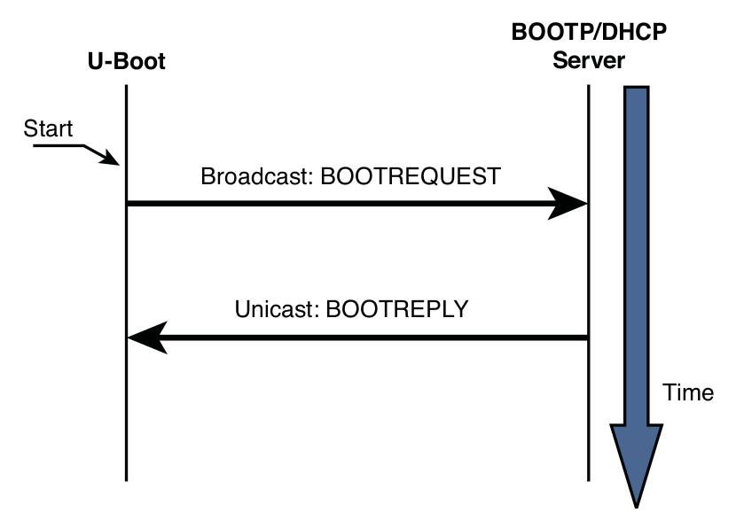

# Chapter 7: Bootloaders

## Role of a Bootloader

Task 1: Basic Processor and Platform initialization

- when power is applied to a processor board, many elements of hardware must
be initialized before even the simplest program can run
- each architecture and processor has a set of predefined actions and
configurations upon release of reset
- most processors have a default address from which the first bytes of code are
fetched upon application of power and release of reset
- when power is first applied, code is fetched from a well-known and predictable
address
- initialization code is typically written in processor's assembly language

Task 2: Fetching and booting an operating system
- locating, loading, and passing control to the primary operating system

Advanced Features:
- validate an OS image
- upgrade itself or an OS image
- choose from among several OS image based on a developer-defined policy
    
- when the OS takes control, the bootloader is overwritten and ceases to exist

## Bootloader Challenges

- even a simple C program requires significant hardware and software resources
- the C runtime environment transparently provides the infrastructure so that
the application developer does not need to know or care about the details
- this is not the case for a bootloader -> every resource that a bootloader
requires must be carefully initialized and allocated before it is used

### DRAM Controller

- DRAM controllers require specialized hardware controllers to enable read and
write cycles
- further complication of DRAM: they must be constantly refreshed
- task of DRAM controller:
    * configure DRAM
    * keep DRAM refreshed within the manufacturer's timing specification
    * respond to various read and write commands from the processor
- one of the first things a bootloader must do is enable the memory subsystem
- without DRAM control, not much an happen in an embedded system
- for faster execution, the bootloader typically loads itself into DRAM after
setup

### Flash vs RAM

- bootloader is stored in nonvolatile memory but loaded into RAM for execution
- on desktop Linux all infrastructure (libraries, OS, compiler) is there to
simply load a program into RAM
- the bootloader must create its own operational context and move itself to a
suitable location in RAM

### Image Complexity

On desktop Linux:
- the compiler and binary utilities are preconfigured to build a binary
executable to build a binary executable image containing the proper components
needed for a given architecture
- the linker places startup (prologue) and shutdown (epilogue) code into the
image -> these objects set up the proper execution context for the application,
which typically starts at `main()`

On bootloader:
- when bootloader gets control, there is no context or prior execution
environment
- at the beginning there is not even a stack or stack pointer -> simple C
function with local variables does not work
- the compiler and linker must be passed a handful of parameters defining the
characteristics and layout of the final executable image
- two characteristics make it complex: code organization compatible with
processor's boot requirements, the execution context

Characteristic 1:
- the need to organize the startup code in a format compatible with the processor's
boot sequence
- the first executable instruction must be at a predefined location in Flash,
depending on the processor and hardware architecture -> hard-coded address
- linker script is a recipe for constructing a binary executable image

### Execution Context

- when bootloader starts -> no execution context
- what is there at the beginning:
    * not much
    * fetch from flash memory works properly
    * system clock has some default values
- the reset state of each processor is well defined by the manufacturer, but
the reset state of a board is defined by the hardware designers
- at startup most processors have no DRAM available -> no temporary storage for
variables -> no stack
- so first task of bootloader is typically to configure at least enough hardware
to enable a minimal amount of RAM
- when RAM is available, a stack can be allocated using part of RAM, and a
proper context can be constructed to run higher-level languages such as C -> from
this point the processor and platform initialization can be written in something
other than assembly

## A Universal Bootloader: Das U-Boot

- most bootloaders interact with user through a serial port
- many bootloaders are specific to a particular architecture
- U-Boot supports multiple architecture and is very popular in the embedded
community
- U-Boot is configured through a board-specific configuration header file
- important features in a bootloader: BOOTP, DHCP, TFTP
protocols
- BOOTP (Bootstrap Protocol) and DHCP (Dynamic Host Configuration Protocol)
enable a target device with an ethernet port to obtain an IP address and other
network-related configuration information from a central server
- TFTP (Trivial File Transfer Protocol) allows the target device to download
files, e.g. a Linux kernel image, from a TFTP server

BOOTP client/server handshake:



- BOOTP servers no longer exist as stand-alone servers -> DHCP servers typically
support BOOTP protocol packets and are used for BOOTP operations
- the DHCP protocol builds on BOOTP
- typical DHCP target specification:

```bash
host coyote {
    hardware ethernet 00:0e:0c:00:82:f8;
    netmask 255.255.255.0;
    fixed-address 192.168.1.21;
    server-name 192.168.1.9;
    filename “coyote-zImage”;
    option root-path “/home/sandbox/targets/coyote-target”;
}
```
- target board with mac address `00:0e:0c:00:82:f8` gets bound to IP
`192.168.1.21` and contacts server with IP `192.168.1.9` on development machine
to get kernel image `coyote-zImage` and root file system `...coyote-target`

- [documentation of U-Boot](https://u-boot.readthedocs.io/en/latest/)

### Storage Subsystems

- bootloaders support capability of booting images from a variety of nonvolatile
storage devices in addition to the usual flash memory -> different levels of
complexity
- to interact with these storage devices, the bootloader typically must include
additional device drivers/controllers

## Porting U-Boot

- easy porting
- each board must supply a subordinate makefile that supplies board-specific
definitions to the build process -> `config.mk` in `.../board/vendor/<boardname>`
- if board contains one of the supported CPUs, porting U-Boot is straightforward
- if CPU is not available, takes more time to port board
- there is no substitute for detailed knowledge of the underlying hardware

### U-Boot Image Format

- U-Boot expects a small header on the image file that identifies several
attributes of the image -> `mkimage` tool (part of the U-Boot source code) builds
this image header
- Linux kernel distributions have built-in support for building images directly
bootable by U-Boot

## Device Tree Blob (Flat Device Tree)

- device tree blob (DTB), flat device tree, device tree binary, device tree
- a database that represents the hardware components on a given board
- derived from the IBM OpenFirmware specifications
- default mechanism to pass low-level hardware information from the bootloader
to the kernel
- dtb file can be found in the Linux kernel source tree
- for custom board, you need to provide a DTB

### Device Tree Source

- device tree blob is "compiled" by a special compiler that produces the binary
in the proper form for U-Boot and Linux to understand
- the `dtc` compiler
- the flat device tree is made up of device nodes
- device node: an entry in the device tree, usually describing a single device
or bus

### Device Tree Compiler (dtc)

- converts the human-readable device tree source into machine-readable binary
that both U-Boot and the Linux kernel understand
- the device tree source has been merged into the kernel source tree and is
built along with any kernel build

## Other Bootloaders

### Lilo

- Linux Loader (Lilo)
- used for desktop platforms -> x86/IA32 architecture

primary loader:
- has primary bootstrap program that lives on the first sector of bootable disk
drive
- is limited to a disk sector size, usually 512 bytes
- load and pass control to a secondary loader

secondary loader:
- spans multiple sectors
- does most of the bootloader's work

configuration file `lilo.conf`:
- not used by either primary and secondary loader
- used by host operating system during system initialization or administration

### GRUB

- GRUB = GRand Unified Bootloader
- is a GNU project
- typically used with modern commercial Linux distributions

different to LILO:
- GRUB can understand filesystems and kernel image formats
- GRUB can read and modify its configuration at boot time
- GRUB supports booting across a network
- GRUB offers a command-line interface at boot time to modify the boot configuration
- GRUB reads configuration at boot time -> not static configuration -> behavior
can be modified at boot time for different system configuration

similar to LILO:
- GRUB is driven by configuration file `grub.conf`

### Others

- Redboot (open-source) -> Intel, XScale
- Micromonitor -> Cogent
- YAMON -> MIPS
- LinuxBIOS -> x86

How to choose a bootloader:
- Does it support my processor?
- Has it been ported to a board similar to my own?
- Does it support the features I need?
- Does it support the hardware devices I intend to use?
- Is there a large community of users where I might get support?
- Are there any commercial vendors from which I can purchase support?

