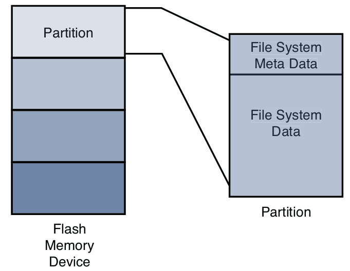

# Chapter 9: File Systems

## Linux File System Concepts

### Partitions

- partition: the logical division of a physical device on which a file system
exists
- a logical division of the physical medium (hard disk, flash memory) whose data
is organized following the specifications of a given partition type
- a physical device either has only a single partition covering all its available
space, or it can be divided into multiple partitions to suit a particular task
- it is like a logical disk onto which a complete file system can be written



- `fdisk` utility: manipulate partitions on block devices
- common partition types are Linux, FAT32, Linux Swap
- after a physical device has been partitioned, each device representing a
partition can be formatted with the file system of choice
- when a partition is formatted with a given file system type, Linux can mount
the corresponding file system from that partition

## ext2

- `mkfs.ext2` utility: makes a file system of type `ext2` on the specified
partition
- inode: the fundamental data structure representing a single file
- block size is a compromise for best performance:
    * large block size waste more space on disks with many small files
    * small block sizes increase the file system overhead of managing metadata
    that describes the block-to-file mapping

### Mounting a File System

- after a file system has been created, we can mount it on a running Linux
system
- the kernel must be compiled with support for specific file system type, either
as compiled-in module or as dynamically loadable module
- `mount` utility: `mount <block device> <mount-point>`
- mount point: the file system we install is rooted at this point in our file
system hierarchy
- typically need to be root to mount a file system

### Checking File System Integrity

- `fsck` (file system check)
- `e2fsck` command:
    * checks the integrity of an ext2 file system
    * should only be run on unmounted file system
    * can repair some errors, but not all
- reasons for file system corruption:
    * unexpected power failure -> Linux closes all open files and unmount file
    systems during shutdown sequence
- `sync` utility:
    * ensure that writes are committed to disk immediately when written
    * forces all queued I/O requests to be committed to their respective devices
    * performance penalty if issued often

### What does ext2 not provide?

- no journaling file system
- boot time after unclean shutdown might be long

## ext3

- powerful, high-performance, robust journaling file system
- extension of ext2 file system with added journaling capability
- journaling:
    * each change to the file system is logged in a special file so that recovery
    is possible from known journaling points
- ext3 can be mounted directly after an unclean shutdown
- with ext3 consistency check like `fsck` is unneeded, because the journal can
simply be played back to ensure the file system's consistency
- ext2 file system can be converted to an ext3 file system (forward-compatible)
and vice versa (backwards-compatible), no need to reformat or rewrite all the
data on disk -> basically only need to create a journal file (`tune2fs` utility)
for ext2 file system

### How does a journaling file system work?

- a journaling file system contains a special file, often hidden from the user
- special file is used to store file system metadata (metadata = data about the
file) and file data itself
- special file is the journal
- before change is made to the file system, it is performed in the journal

## ext4

- builds on ext3 file system
- journaling file system
- removes some limitations of ext3 file system:
    * removed 16-terabyte limit for file systems -> 1 exbibyte
    * supports individual file sizes up to 1024 gigabytes
    * increased performance for the types of loads expected on large server and
    database systems

## ReiserFS

- popular on SuSE and Gentoo
- journaling file system
- guarantees that either a given file system operation completes in its entirety,
or none of it completes
- atomic file system operations: provides API for system programmers to
guarantee the atomicity of a file system transaction
- journaling vs atomic transaction:
    * journaling guarantees that no errors on file system exist, but does not
    guarantee that the file was properly written
    * atomic transaction: protects both the state of the file system (consistency)
    and the data involved in a file system operation

## JFFS2

- flash memory is used extensively in embedded systems programming
- flash memory is less efficient and more prone to data corruption caused by
power loss -> because of much larger write times -> because of large block size
- mostly small files on Linux system -> problem for flash memory due to large
block size -> flash memory must be erased an entire block at a time and size of
block is often multiple of smaller file size
- another problem with flash memory: has a limited lifetime, each block that is -> the
writes must be spread evenly across the blocks of a flash memory device
- second-generation Journaling Flash File System (JFFS2):
    * solves these issues
    * uses technique called wear leveling
- `mkfs.jffs2` utility
- enabling system loggers (`syslogd`,`klogd`) configured to write their data to
flash-based file systems can easily overwhelm a flash device with continuous
write -> premature failure of the underlying flash device

## cramfs

- goal: cram a file system into a small ROM
- useful for embedded systems that contain a small ROM or flash memory that
holds static data and programs
- designed to be simple and small, and compress things well
- read-only file system
- `mkcramfs` utility
- limited in terms of maximum file sizes, maximum number of files etc. -> ideal
for boot ROMs with read-only operation + fast compression

## Network File System (NFS)

- NFS enables you to export a directory on an NFS server and mount that directory
on a remote client machine as if it were a local file system
- when used on target board, an embedded developer can have access to a huge
number of files, libraries, tools and utilities during development and debugging,
even if target is resource constrained
- kernel must be configured with NFS support, both server-side and client-side
- NFS is configured through configuration file `/etc/exports`
- you can mount your embedded system's root file system entirely from an NFS
server
- kernel command line to enable NFS server:

```bash
ip=<client-ip>:<server-ip>:<gw-ip>:<netmask>:<hostname>:<device>:<autoconf> \
nfsroot=<server-ip>:<directory-path> \
root=/dev/nfs
``` 

## Pseudo File Systems

- provide a range of facilities (e.g. kernel data structures) useful in a wide
range of applications
- are not actual physical devices -> virtual file system

### `/proc` File System

- original idea: interface that allows the kernel to communicate information
about each running process on a Linux system
- currently provides more than just process information
- many user-level functions rely on the contents of the `/proc` file system to
do their job
- your system must have a mount point called `/proc` at the top-level directory
tree as a destination for the `/proc` file system to be mounted on
- each user process running in the kernel is represented by an entry in the
`/proc` file system -> processes in the `/proc` file system are represented by
a directory that is given the PID number as its name -> contain much useful
information about each process
- `top` and `ps` utility utilize the `/proc` file system

### `sysfs`

- not an actual physical device
- models specific kernel objects such as physical devices and provides a way to
associate devices with device drivers
- `/sys` directory
- `systool` utility: helps to browse the sysfs file system directory structure

## Other File Systems

- `ramfs`: example of how virtual file systems can be written -> mostly
educational purposes
- `tmpfs`:
    * everything is stored in kernel virtual memory
    * contents are lost on power-down or reboot
    * useful for fast temporary file storage
    * improvement over ramdisks due to capability to resize itself dynamically
    to meet operational requirements

