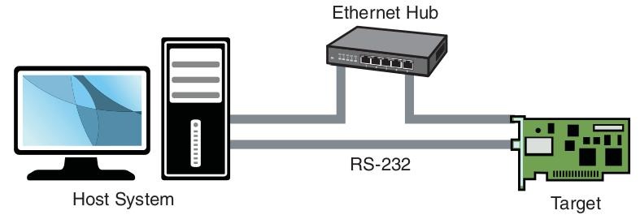

# Chapter 12: Embedded Development Environment

## Cross-Development Environment

- a system often has three compilers and three (or more) versions of standard
header files
- host: development workstation that is sitting on your desktop and running your
favorite Linux desktop distribution
- target: embedded hardware platform
- native development: compilation and building of applications on and for your
host system
- cross-development: compilation and building of applications on the host system
that will be run on the embedded system
- typical cross-development environment:

- developer has a serial terminal on the host connected to the RS-232 serial
port, one or more telnet or SSH terminal sessions to the target board, and
potentially one or more debug sessions using Ethernet as the connection medium
- basic idea:
    * host system provides the horsepower to run the compilers, debuggers,
    editors, and other utilities
    * target executes only the applications designed for it

### "Hello World" Embedded

- toolchain = compiler, linker and associated utilities
- startup + shutdown prologue code: deals with details such as the environment
and arguments passed to your program, startup and shutdown house-keeping, exit
handling, and more
- when compiling an application for a different architecture with a
cross-compiler, we must make sure that the compiler does not use the default
host include directories or library paths -> toolchain must be properly
configured

## Host System Requirements

- a properly configured toolchain: download and compile one yourself or obtain
a commercial one
- Linux distribution targeted for your embedded system architecture: build your
own or get a commercial one -> a popular one is Embedded Linux Development Kit (ELDK)
- development requires the following capabilities:
    * cross toolchain and libraries
    * target system packages, including programs, utilities, and libraries
    * host tools such as editors, debuggers, and utilities
    * servers for hosting your target board
- if you get a ready-built embedded Linux development environment on your
workstation, the toolchain and components have already been preconfigured to
work together, e.g. the toolchain has been configured with default directory
search paths that match the location of the target header files and system
libraries on your development workstation

### Hardware Debug Probe

- hardware-assisted debugging might also be needed
- hardware probe connected to your host (often via Ethernet) and connected to
your target via a debug connector on the board

## Hosting Target Boards

- ethernet connection between host and target is not strictly necessary, but
very useful -> NFS root mount configuration, TFTP
- TFTP: lightweight protocol for moving files between a TFTP server and TFTP
client over Ethernet, similar to FTP -> faster than serial downloads
- using TFTP from your bootloader to load the kernel + loading root file system
or ramdisk image

### TFTP Server

- TFTP is a TCP/IP service that must be enabled on your workstation
- must instruct workstation to respond to incoming TFTP packets -> run a TFTP
server daemon
- example: HPA's TFTP server (`tftpd-hpa` package)
- configure with configuration file `/etc/default/tftpd-hpa`

### BOOTP/DHCP Server

- DHCP server on host simplifies configuration management for embedded target
- Linux can use two methods to initialize its Ethernet/IP interface during boot:
    * hard-code the Ethernet interface parameters either on the Linux kernel
    command-line or in the default configuration, such as a static IP configuration
    * configure the kernel to automatically detect the network settings at boot
    time -> more flexible
- DHCP/BOOTP: the protocol your target and server use to accomplish automatic
detection of network settings
- DHCP server controls the IP address assignments for IP subnets for which it
has been configured, and for DHCP/BOOTP clients that have been configured to
participate
- DHCP server listens for requests from a DHCP client, e.g. target board, and
assigns addresses and other pertinent information to the client as part of the
boot process
- typical DHCP exchange (target auto-configuration):
1. client (target) transmits a broadcast frame attempting to discover a DHCP
server (`DHCPDISCOVER` message)
2. server responds (if properly configured) by offering an IP address for the
client (`DHCPOFFER` message)
3. client responds by testing this IP address locally (send `DHCPREQUEST` package
to server)
4. server acknowledges the IP address assignment to the client (`DHCPACK`)

### NFS Server

- NFS root mount is a powerful tool
- advantages:
    * your root file system is not size-restricted by your board's own limited
    resources, such as flash memory
    * changes made to your application files during development are immediately
    available to your target system
    * you can debug and boot your kernel before developing and debugging your
    root file system
- kernel must be compiled with support for NFS
- DHCP and TFTP are both user space utilities, NFS requires kernel support
- NFS server gets instructions from exports file `/etc/exports` -> entries in
this file allow a client to remotely mount any of the listed directories

### Target NFS Root Mount

These steps are required to set NFS up:
1. configure your NFS server, and export a proper target file system for your
architecture
2. configure your target kernel with NFS client services and root file systems
on NFS
3. enable kernel-level autoconfiguration of your target's Ethernet interface
4. provide your target Ethernet IP configuration using the kernel command line
or static kernel configuration option
5. provide a kernel configuration command line enabled for NFS

### U-Boot NFS Root Mount

- enable NFS command line in U-Boot with `setenv bootargs ... root=/dev/nfs rw ip=dhcp nfsroot=<ip-address>:<remote-directory-path>`
- then load a kernel using TFTP server: `tftpboot <location-to-load> <image-name>`
- after kernel has completed the IP autoconfiguration, it can mount the root
file system using the supplied parameters
- after NFS root file system has been mounted, initialization completes

