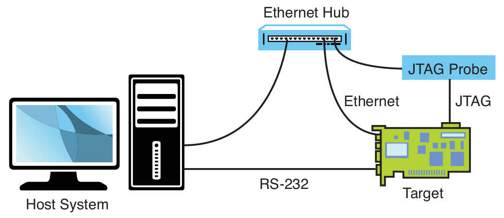

# Chapter 14: Kernel Debugging Techniques

## Challenges to Kernel Debugging

- Common Challenges while debugging Linux kernels:
    * Linux kernel code is highly optimized for speed of execution in many areas.
    * Compilers use optimization techniques that complicate the correlation of
    C source to actual machine instruction flow. Inline functions are a good
    example of this.
    * Single-stepping through compiler optimized code often produces unusual
    and unexpected results.
    * Virtual memory isolates user space memory from kernel memory and can
    make various debugging scenarios especially difficult.
    * Some code cannot be stepped through with traditional debuggers.
    * Startup code can be especially difficult because of its proximity to the
    hardware and the limited resources available (for example, no console,
    limited memory mapping, and so on).
- by default the Linux kernel is compiled with the `-O2` flag of the GCC
compiler -> enables many optimization algorithms that can change the fundamental
structure and order of your code, e.g. inline functions
- single-stepping through the Linux kernel from difficult to impossible

## Using KGDB for Kernel Debugging

- two methods for symbolic source-level debugging within the Linux kernel:
    * using KGDB as a remote GDB agent
    * using a hardware JTAG probe to control the processor
- KGDB: a set of Linux kernel patches that provide an interface to GDB through
its remote serial protocol
- implements a GDB stub that communicates with a cross-gdb running on your host
development workstation
- KGDB is part of the kernel running on your target system
- KGDB implements the hooks required to interface GDB with your target board to
enable features such as setting breakpoints, examining memory, and enabling
single-step program execution
- linux boots until KGDB-defined breakpoint `kgdb_breakpoint()` and waits for
GDB on host to connect

### Common kernel breakpoints

- `panic`: allows debugger to be invoked if a later event generates a panic ->
allows to examine the system state at the time of the panic
- `sys_sync`: useful way to halt the kernel and trap into the debugger from user
space by entering the sync command from a terminal running on your target
hardware
- we cannot debug before breakpoints, for this we need hardware-assisted debug
probe
- it can be useful to share a console serial port with KGDB

### Debugging very early kernel code

- debug initialization code after serial driver has been called and registered
- support for early kernel debug requires a KGDB I/O driver that supports early
kernel debug -> easy method: serial driver (must be compiled into the kernel)
- use `kgdbwait` command line option to instruct KGDB to wait for commands from
the user
- `kgdboc` is used to specify the serial port to use

## Kernel Debugging Techniques

### Debugging Optimized Kernel Code

- Linux kernel is compiled by default with optimization level -O2
- complications: instruction reordering, function inlining

### GDB User-Defined Commands

- GDB looks for an initialization file `.gdbinit` on startup
- GDB loads this initialization file and acts on the commands within it
- user-defined commands (macros) can be defined there
- useful to define commands to display specific kernel data that you might want
to access during kernel debugging

### Debugging Loadable Modules

- loadable kernel modules = device drivers
- loadable kernel modules can be reloaded without a complete kernel reboot
- complication with kernel modules: gaining access to the symbolic debug
information
- kernel modules are dynamically linked when they are loaded into the kernel,
then the symbolic information contained in the object file will be adjusted and
is only then of use
- `add-symbol-file` GDB command loads symbols from the specified object file,
assuming that the module itself has already been loaded
- debug a module's initialization routine by placing a breakpoint in `module.c`
at the call to `mod->init()`

### `printk` Debugging

- you can call printk from any context, including interrupt handlers
- kernel version of `printf()` C library function
- printk requires a console device
- beware: many calls to printk occur before the console device has been
initialized
- printk kernel markers:
    * `KERN_EMERG (0)`: system is unusable
    * `KERN_ALERT (1)`: action must be taken immediately
    * `KERN_CRIT (2)`: critical conditions
    * `KERN_ERR (3)`: error conditions
    * `KERN_WARNING (4)`: warning conditions
    * `KERN_NOTICE (5)`: normal but significant condition
    * `KERN_INFO (6)`: informational
    * `KERN_DEBUG (7)`: debug-level messages
- default severity level is `KERN_WARNING`
- all printk messages below a predefined loglevel are displayed on the system
console device
- use `klogd` (kernel log daemon) and `syslogd` (system log daemon) to control
the logging behavior of printk messages

## Hardware-Assisted Debugging

- you can't debug early kernel startup code with KGDB because KGDB is not
initialized until after most of the low-level hardware initialization code has
executed
- hardware-debug probes are the way to go
- JTAG probes:
    * use a low-level communications method that was first employed for boundary
    scan testing of integrated circuits defined by the Joint Test Action Group (JTAG)
    * contains a small connector designed for connection to your target board
    * connector is often a simple square-pin header and ribbon cable arrangement
    * most modern high-performance CPUs contain a JTAG interface that is designed
    to provide this software debugging capability
    * JTAG probe connects to CPU JTAG interface on one side, the other side is
    connected to host development system usually through Ethernet, USB, or a
    parallel port

- JTAG probes can be complex to setup
- when using JTAG probe, a minimal level of CPU and board initialization must be
performed before anything else can be done -> requires configuration file
- developer's responsibility to customize this configuration file with the
proper directives for his own board -> requires detailed knowledge of the CPU
and board-level design features
- hardware probes are used in two ways:
    * have a user interface that enables the developer to use features of the
    probe, e.g. program flash or download binary images
    * is a front end to GDB or other open source-level debuggers

### Debugging with a JTAG probe

- instead of interfacing directly with a JTAG probe through its user interface,
many JTAG probes can interface with your source-level debugger
- GDB is instructed to begin a debug session with the target using an external
connection, usually an Ethernet connection
- the debugger passes commands back and forth between itself and the JTAG probe
- the JTAG probe uses the GDB remote protocol to control the hardware on behalf
of the debugger
- JTAG probes are useful for source-level debugging of bootloader and early
startup code
- many processors contain debugging registers that include the capability to set
traditional address breakpoints (stop when the program reaches a specific
address) as well as data breakpoints (stop on conditional access of a specified
memory address -> these registers are typically limited, many processors contain
only one or two such registers

## When It Doesn't Boot

### Early Serial Debug Output

- `CONFIG_EARLY_PRINTK`: this feature is on by default in most kernel
configurations, it enables serial console output much sooner than the registration
of the serial driver

### Dumping the printk Log Buffer

- you can't see any printk messages until later in the boot sequence, when the
console device has been initialized
- often when board hangs on boot, quite a few messages are stuck in the printk
buffer
- either JTAG or use bootloader with its memory dump capability to display
contents of the printk buffer after reset -> `__lof_buf` buffer, find address
through `System.map`
- some bootloaders might initialize memory contents and thus destroy any remaining
data in the buffer, then this technique can not be used

### KGDB on Panic

- KGDB passes control to GDB on a kernel panic, enabling you to examine a
backtrace and isolate the cause of the kernel panic

