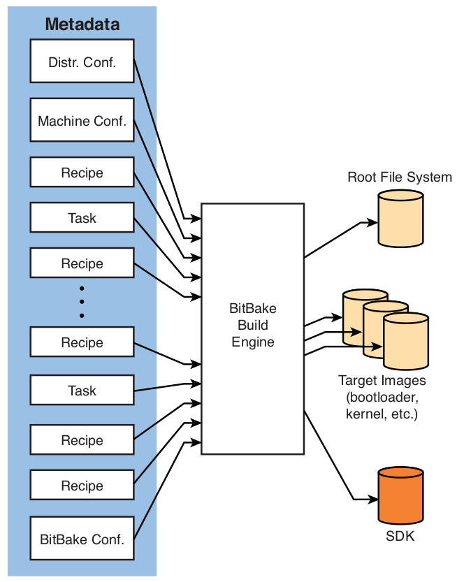

# Chapter 16: Open Source Build Systems

## Why use a build system?

- helps you create an embedded Linux distribution tailored to your unique
requirements
- includes a cross-toolchain and all the packages required for your project
- what functionality has a build system:
    * generates root file systems in your choice of binary formats
    * embedded Linux kernel image with your configuration
    * bootloader image
    * other necessary files and utilities so that these can be properly deployed
- it is nontrivial to build an embedded Linux distribution from scratch

## Scratchbox

- a cross-compilation toolkit that became popular during its use in the Maemo (now
merged with Moblin to become MeeGo) project targeting the Nokia N770 handheld computer
- Scratchbox model is to provide the developer with a development environment
that looks like the target (through qemu)
- includes remote shell feature `sbrsh` that allows the developer to perform
certain actions directly on real target hardware

## Buildroot

- a set of makefiles and patches in a system designed to build a complete
embedded Linux distribution
- major features:
    * It can build all the required components for your embedded Linux product,
    including cross-compiler, root file system, kernel image, and bootloader.
    * It allows for simple configuration using the familiar Linux kernel menuconfig
    and related utilities.
    * It supports several hundred packages for user space applications and libraries,
    including GTK2, Qt, GStreamer, and many network utilities.
    * It supports uClibc or glibc, among other target libraries.
    * It has a simple structure based on the makefile language that is well
    understood.
- Buildroot build steps:
    * downloads source files for all the configured packages and
    toolchains
    * builds the cross-compilation toolchain
    * using the cross-toolchain, configuring and compiling all the requested
    packages
    * building a kernel image if configured to do so
    * creating a root file system in the format of your choosing

## OpenEmbedded

- shares some of conceptual origins with the Portage build system from Gentoo,
but it also builds on some concepts from other build systems, including
Buildroot
- a best-in-class cross-compile environment

### OpenEmbedded Composition

- composed of two primary elements:
    * BitBake: build engine
    * Metadata: set of instructions that tell BitBake what to build

- BitBake processes the metadata, which provides instructions that describe what
to build
- at the end of the build process, BitBake produces all the requested images,
including the root filesystem, kernel, bootloader, and intermediate images such
as device tree binary
- can create Software Development Kits (SDKs): contain toolchains, libraries,
and header files for application developers to use in a self-contained
development environment

### BitBake Metadata

- Metadata can be grouped into 4 categories:
    * Recipes
    * Classes
    * Tasks
    * Configuration
- Recipes (`*.bb`):
    * most common
    * contain instructions for BitBake to build a single package
    * describe the package and its dependencies
    * creates a binary package in the `*.ipk` package format
- Classes (`*.bbclass`):
    * similar to classes in object-oriented programming language such as C++ o
    Java
    * used to encapsulate common functionality used across a large number of
    recipes
- Tasks:
    * used to group packages for use in building a root file system
    * simple files, often containing little more than a few lines of package
    dependencies
- Configuration metadata:
    * defines the overall behavior of BitBake
    * provides global build variables such as build paths, default image
    construction commands, and specifics of a particular machine
    * defines characteristics of the distribution under construction, such as
    which toolchain and C library (uClibc, glibc,...) to use

### Configuring OpenEmbedded

- some attributes that must be defined:
    * target architecture
    * processor type
    * machine features such as serial port and baud rate and flash organization
    * choice of C library, such as glibc or one of the several embedded-optimized
    alternatives
    * toolchain and binutils version and source (external or built by BitBake)
    * Root file system image type
    * kernel version
- configuration metadata can be generalized in 4 categories:
    * BitBake: BitBake's plumbing, defines system-wide variables such as system
    paths, target file system layout, many architecture-dependent build variables
    * machine: the proper place to define machine-specific features such as
    serial port configuration and any specific requirements for image format,
    kernel version, bootloader version -> target architecture is specified in the
    machine file
    * distribution: defines aspects of the entire embedded Linux distribution
    that you are building, specifies toolchain type, C library type and distribution
    version
    * local: tune and customize a distribution to your liking

