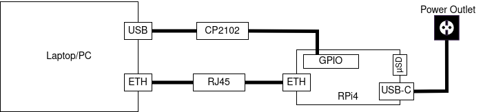

# Embedded Linux on the Raspberry Pi 4 (Model B)

To better understand Embedded Linux, I want to learn by practice on the RPi4
hardware board. I will specifically follow [this tutorial](https://hechao.li/2021/12/20/Boot-Raspberry-Pi-4-Using-uboot-and-Initramfs/)
but divert from it in certain areas as some of the instructions were not working
properly for me.

## Equipment/Requirements

- laptop/PC with Ubuntu 22.04 installed
- Rasperry Pi 4 Model B (RPi4)
- power cable
- (micro)SD card
- USB-to-TTL adapter (e.g. CP2102)
- RJ45/Ethernet cable

## SD card preparation

The SD card will be used to store the bootloader and the root filesystem. After
inserting the SD card, we need to create two partitions and properly format them:

- `boot`: `FAT32` format, 100MiB
- `root`: `ext4` format, remaining space

I used the `gparted` utility to partition and format the SD card. You can also
do in on the command line as described in the reference source, but I prefer
the graphical way for this situation.  

You can use the `lsblk` command to see the available block devices and should
see your partitions as follows:

```bash
$ lsblk
...
mmcblk0     179:0    0  14,6G  0 disk
├─mmcblk0p1 179:1    0   100M  0 part
└─mmcblk0p2 179:2    0  14,5G  0 part
...
```

Next, we mount the partitions:

```bash
$ sudo mount /dev/mmcblk0p1 /mnt/boot
$ sudo mount /dev/mmcblk0p2 /mnt/root
```

## Toolchain

In the reference source, they describe how to build a toolchain based on
`crosstool-NG`. This probably works, but I simply installed the
`gcc-aarch64-linux-gnu` Ubuntu package. This way, I do not have to deal with
any custom toolchain setup. It would also be interesting to use the
[official ARM toolchain](https://developer.arm.com/downloads/-/arm-gnu-toolchain-downloads).  

Since we install the official Ubuntu package, we do not have to worry to include
the cross-toolchain in our environment path. We can simply specify
`CROSS_COMPILE=aarch64-linux-gnu-` as a prefix for (make-based) build systems.

## Bootloader

The Raspberry Pi 4 uses an interesting boot procedure. First, some firmware (ROM
code) initializes the basic hardware and loads a Secondary Program Loader (SPL).
This program then loads the main bootloader, in our case we use U-Boot. U-Boot
will load the kernel, the Flattened Device Tree (FDT) and optionally the initial
RAM disk (`initramfs`) into DRAM. Once the kernel is loaded, the bootloader will
hand over the control to it.  

### Download U-Boot source

```bash
$ git clone git://git.denx.de/u-boot.git
$ cd u-boot
```

### Configure U-Boot

```bash
$ make CROSS_COMPILE=aarch64-linux-gnu- rpi_4_defconfig
```

### Build U-Boot

```bash
$ make CROSS_COMPILE=aarch64-linux-gnu-
```

This command will generate the `u-boot.bin` binary.

### Install U-Boot

The `u-boot.bin` must now be copied to the `boot` partition of our SD card:

```bash
$ sudo cp u-boot.bin /mnt/boot
```

We further need to install the following Raspberry-Pi specific boot files that
can be found under [this link](https://github.com/raspberrypi/firmware/tree/master/boot):

- `bootcode.bin`
- `start4.elf`
- `fixup4.dat`

We further need to configure the Raspberry Pi to load the U-Boot binary:

```bash
$ cat << EOF > config.txt
enable_uart=1
arm_64bit=1
kernel=u-boot.bin
dtoverlay=disable-bt
EOF
```

We disable Bluetooth, as otherwise we can not properly use the UART0 pins for
console output.  

The listed files must all be copied to the `boot` partition.

## Kernel

### Download the kernel source

Download the kernel source tree for RPi-provided kernel builds:

```bash
$ git clone https://github.com/raspberrypi/linux.git linux-rpi
$ cd linux-rpi
```

We could theoretically also use the original Linux source, but it seems like
there is no default defconfig for the RPi4.

### Configure the kernel

We just use the default config for RPi4:

```bash
$ make ARCH=arm64 CROSS_COMPILE=aarch64-linux-gnu- bcm2711_defconfig
```

### Build the kernel

```bash
$ make -j$(nproc) ARCH=arm64 CROSS_COMPILE=aarch64-linux-gnu-
```

Replace the `nproc` with the number of parallel processes you want to run for
the build. This build will take a while and if you let all CPUs work at the same
time, your laptop/PC might heat up significantly.

### Install the kernel and device tree

```bash
$ sudo cp arch/arm64/boot/Image /mnt/boot
$ sudo cp arch/arm64/boot/dts/broadcom/bcm2711-rpi-4-b.dtb /mnt/boot/
```

## Root filesystem

We will create a root file system according to the `Filesystem Hierarchy Standard`.

### Create Directories

```bash
$ mkdir rootfs
$ cd rootfs
$ mkdir {bin,dev,etc,home,lib64,proc,sbin,sys,tmp,usr,var}
$ mkdir usr/{bin,lib,sbin}
$ mkdir var/log

# Create a symbolink lib pointing to lib64
$ ln -s lib64 lib

# Change the owner of the directories to be root
# Because current user doesn't exist on target device
$ sudo chown -R root:root *
```

### Build and Install Busybox

Busybox will provide essential Linux utilities, e.g. the shell.

```bash
# Download the source code
$ wget https://busybox.net/downloads/busybox-1.33.2.tar.bz2
$ tar xf busybox-1.33.2.tar.bz2
$ cd busybox-1.33.2/

# Config
$ make CROSS_COMPILE=aarch64-linux-gnu- defconfig
# Change the install directory to be the one just created
$ sed -i 's%^CONFIG_PREFIX=.*$%CONFIG_PREFIX="/home/hechaol/rootfs"%' .config

# Build
$ make CROSS_COMPILE=aarch64-linux-gnu-

# Install
# Use sudo because the directory is now owned by root
$ sudo make CROSS_COMPILE=aarch64-linux-gnu- install
```

### Install required libraries

Next, we install shared libraries required by Busybox:

```bash
$ readelf -a ~/rootfs/bin/busybox | grep -E "(program interpreter)|(Shared library)"
      [Requesting program interpreter: /lib/ld-linux-aarch64.so.1]
 0x0000000000000001 (NEEDED)             Shared library: [libm.so.6]
 0x0000000000000001 (NEEDED)             Shared library: [libresolv.so.2]
 0x0000000000000001 (NEEDED)             Shared library: [libc.so.6]
 0x0000000000000001 (NEEDED)             Shared library: [ld-linux-aarch64.so.1]
```

We need to copy these files from the cross-toolchain's `lib` directory under
`/usr/aarch64-linux-gnu/lib/` (for other toolchains, location might differ) to
the `rootfs/lib` directory:

```bash
$ sudo cp -L /usr/aarch64-linux-gnu/lib/{ld-linux-aarch64.so.1,libm.so.6,libresolv.so.2,libc.so.6} ~/rootfs/lib64/
```

### Create device nodes

```bash
$ cd ~/rootfs
$ sudo mknod -m 666 dev/null c 1 3
$ sudo mknod -m 600 dev/console c 5 1
```

## Boot the board

### Hardware Setup



- `Laptop/PC`: Development host
- `RPi4`: Raspberry Pi 4 Model B hardware board (target machine).
- `CP2102`: The CP2102 USB-to-TTL adapter is used for console output through UART.
- `USB-C`: connect to power outlet in the wall or simply plug the cable into an ordinary USB port on the PC to power up the board
- `µSD`: microSD card slot -> insert an SD card that stores important (boot) files in non-volatile flash memory
- (TODO) `RJ45`: Ethernet cable that connects PC with hardware board to exchange files over TFTP/DHCP.

### Option 1: Boot with a initramfs

**Build an initramfs:**

```bash
$ cd ~/rootfs
$ find . | cpio -H newc -ov --owner root:root -F ../initramfs.cpio
$ cd ..
$ gzip initramfs.cpio
$ ~/u-boot/tools/mkimage -A arm64 -O linux -T ramdisk -d initramfs.cpio.gz uRamdisk

# Copy the initramffs to boot partition
$ sudo cp uRamdisk /mnt/boot/
```

**Configure U-Boot:**

```bash
$ cat << EOF > boot_cmd.txt
fatload mmc 0:1 \${kernel_addr_r} Image
fatload mmc 0:1 \${ramdisk_addr_r} uRamdisk
setenv bootargs 8250.nr_uarts=1 console=ttyS0,115200 rdinit=/bin/sh
booti \${kernel_addr_r} \${ramdisk_addr_r} \${fdt_addr}
EOF
$ ~/u-boot/tools/mkimage -A arm64 -O linux -T script -C none -d boot_cmd.txt boot.scr

# Copy the compiled boot script to boot partition
$ sudo cp boot.scr /mnt/boot/
```

We do not have to explicitly load the DTB file as it is inherited by default
from the firmware. I had to put `8250.nr_uarts=1`, otherwise I was not able to
see any console output and the boot process gets stuck after `Starting kernel ...`.

**Boot the board:**

When powering up the board, you can expect the following output:

```bash
U-Boot 2023.10-01124-g9a3a58396b (Oct 22 2023 - 09:07:19 +0200)

DRAM:  948 MiB (effective 7.9 GiB)
RPI 4 Model B (0xd03114)
Core:  211 devices, 16 uclasses, devicetree: board
MMC:   mmcnr@7e300000: 1, mmc@7e340000: 0
Loading Environment from FAT... Unable to read "uboot.env" from mmc0:1...
In:    serial,usbkbd
Out:   serial,vidconsole
Err:   serial,vidconsole
Net:   eth0: ethernet@7d580000
PCIe BRCM: link up, 5.0 Gbps x1 (SSC)
starting USB...
Bus xhci_pci: Register 5000420 NbrPorts 5
Starting the controller
USB XHCI 1.00
scanning bus xhci_pci for devices... 2 USB Device(s) found
       scanning usb for storage devices... 0 Storage Device(s) found
Hit any key to stop autoboot:  0
Card did not respond to voltage select! : -110
** Booting bootflow 'mmc@7e340000.bootdev.part_1' with script
23589376 bytes read in 1219 ms (18.5 MiB/s)
1832160 bytes read in 134 ms (13 MiB/s)
Moving Image from 0x80000 to 0x200000, end=19a0000
## Loading init Ramdisk from Legacy Image at 02700000 ...
   Image Name:
   Image Type:   AArch64 Linux RAMDisk Image (gzip compressed)
   Data Size:    1832096 Bytes = 1.7 MiB
   Load Address: 00000000
   Entry Point:  00000000
   Verifying Checksum ... OK
## Flattened Device Tree blob at 2eff2600
   Booting using the fdt blob at 0x2eff2600
Working FDT set to 2eff2600
   Using Device Tree in place at 000000002eff2600, end 000000002f002fa0
Working FDT set to 2eff2600

Starting kernel ...

[    0.000000] Booting Linux on physical CPU 0x0000000000 [0x410fd083]
[    0.000000] Linux version 6.1.58-v8+ (lukas@lukas-ThinkPad-E495) (aarch64-linux-gnu-gcc (Ubuntu 11.4.0-1ubuntu1~22.04) 11.4.0, GNU ld (GNU Binutils for Ubuntu) 2.38) #1 SMP PREEMPT Mon Oct 23 07:53:44 CEST 2023
[    0.000000] random: crng init done
[    0.000000] Machine model: Raspberry Pi 4 Model B Rev 1.4
[    0.000000] efi: UEFI not found.
[    0.000000] Reserved memory: created CMA memory pool at 0x000000002ac00000, size 64 MiB
[    0.000000] OF: reserved mem: initialized node linux,cma, compatible id shared-dma-pool
[    0.000000] Zone ranges:
[    0.000000]   DMA      [mem 0x0000000000000000-0x000000003fffffff]
[    0.000000]   DMA32    [mem 0x0000000040000000-0x00000000ffffffff]
[    0.000000]   Normal   [mem 0x0000000100000000-0x00000001ffffffff]
[    0.000000] Movable zone start for each node
[    0.000000] Early memory node ranges
[    0.000000]   node   0: [mem 0x0000000000000000-0x000000003b3fffff]
[    0.000000]   node   0: [mem 0x0000000040000000-0x00000000fbffffff]
[    0.000000]   node   0: [mem 0x0000000100000000-0x00000001ffffffff]
[    0.000000] Initmem setup node 0 [mem 0x0000000000000000-0x00000001ffffffff]
[    0.000000] On node 0, zone DMA32: 19456 pages in unavailable ranges
[    0.000000] On node 0, zone Normal: 16384 pages in unavailable ranges
[    0.000000] percpu: Embedded 29 pages/cpu s79144 r8192 d31448 u118784
[    0.000000] Detected PIPT I-cache on CPU0
[    0.000000] CPU features: detected: Spectre-v2
[    0.000000] CPU features: detected: Spectre-v3a
[    0.000000] CPU features: detected: Spectre-v4
[    0.000000] CPU features: detected: Spectre-BHB
[    0.000000] CPU features: kernel page table isolation forced ON by KASLR
[    0.000000] CPU features: detected: Kernel page table isolation (KPTI)
[    0.000000] CPU features: detected: ARM erratum 1742098
[    0.000000] CPU features: detected: ARM errata 1165522, 1319367, or 1530923
[    0.000000] alternatives: applying boot alternatives
[    0.000000] Built 1 zonelists, mobility grouping on.  Total pages: 2028848
[    0.000000] Kernel command line: 8250.nr_uarts=1 console=ttyS0,115200 rdinit=/bin/sh
[    0.000000] Dentry cache hash table entries: 1048576 (order: 11, 8388608 bytes, linear)
[    0.000000] Inode-cache hash table entries: 524288 (order: 10, 4194304 bytes, linear)
[    0.000000] mem auto-init: stack:off, heap alloc:off, heap free:off
[    0.000000] software IO TLB: area num 4.
[    0.000000] software IO TLB: mapped [mem 0x0000000037400000-0x000000003b400000] (64MB)
[    0.000000] Memory: 7927104K/8245248K available (12352K kernel code, 2172K rwdata, 4156K rodata, 4224K init, 1082K bss, 252608K reserved, 65536K cma-reserved)
[    0.000000] SLUB: HWalign=64, Order=0-3, MinObjects=0, CPUs=4, Nodes=1
[    0.000000] ftrace: allocating 40113 entries in 157 pages
[    0.000000] ftrace: allocated 157 pages with 5 groups
[    0.000000] trace event string verifier disabled
[    0.000000] rcu: Preemptible hierarchical RCU implementation.
[    0.000000] rcu: 	RCU event tracing is enabled.
[    0.000000] rcu: 	RCU restricting CPUs from NR_CPUS=256 to nr_cpu_ids=4.
[    0.000000] 	Trampoline variant of Tasks RCU enabled.
[    0.000000] 	Rude variant of Tasks RCU enabled.
[    0.000000] 	Tracing variant of Tasks RCU enabled.
[    0.000000] rcu: RCU calculated value of scheduler-enlistment delay is 25 jiffies.
[    0.000000] rcu: Adjusting geometry for rcu_fanout_leaf=16, nr_cpu_ids=4
[    0.000000] NR_IRQS: 64, nr_irqs: 64, preallocated irqs: 0
[    0.000000] Root IRQ handler: gic_handle_irq
[    0.000000] GIC: Using split EOI/Deactivate mode
[    0.000000] rcu: srcu_init: Setting srcu_struct sizes based on contention.
[    0.000000] arch_timer: cp15 timer(s) running at 54.00MHz (phys).
[    0.000000] clocksource: arch_sys_counter: mask: 0xffffffffffffff max_cycles: 0xc743ce346, max_idle_ns: 440795203123 ns
[    0.000000] sched_clock: 56 bits at 54MHz, resolution 18ns, wraps every 4398046511102ns
[    0.000299] Console: colour dummy device 80x25
[    0.000374] Calibrating delay loop (skipped), value calculated using timer frequency.. 108.00 BogoMIPS (lpj=216000)
[    0.000397] pid_max: default: 32768 minimum: 301
[    0.000510] LSM: Security Framework initializing
[    0.000724] Mount-cache hash table entries: 16384 (order: 5, 131072 bytes, linear)
[    0.000803] Mountpoint-cache hash table entries: 16384 (order: 5, 131072 bytes, linear)
[    0.001996] cgroup: Disabling memory control group subsystem
[    0.004024] cblist_init_generic: Setting adjustable number of callback queues.
[    0.004037] cblist_init_generic: Setting shift to 2 and lim to 1.
[    0.004206] cblist_init_generic: Setting adjustable number of callback queues.
[    0.004217] cblist_init_generic: Setting shift to 2 and lim to 1.
[    0.004377] cblist_init_generic: Setting adjustable number of callback queues.
[    0.004388] cblist_init_generic: Setting shift to 2 and lim to 1.
[    0.004806] rcu: Hierarchical SRCU implementation.
[    0.004817] rcu: 	Max phase no-delay instances is 1000.
[    0.006831] EFI services will not be available.
[    0.007305] smp: Bringing up secondary CPUs ...
[    0.008314] Detected PIPT I-cache on CPU1
[    0.008457] CPU1: Booted secondary processor 0x0000000001 [0x410fd083]
[    0.009513] Detected PIPT I-cache on CPU2
[    0.009636] CPU2: Booted secondary processor 0x0000000002 [0x410fd083]
[    0.010663] Detected PIPT I-cache on CPU3
[    0.010783] CPU3: Booted secondary processor 0x0000000003 [0x410fd083]
[    0.010928] smp: Brought up 1 node, 4 CPUs
[    0.010943] SMP: Total of 4 processors activated.
[    0.010954] CPU features: detected: 32-bit EL0 Support
[    0.010963] CPU features: detected: 32-bit EL1 Support
[    0.010975] CPU features: detected: CRC32 instructions
[    0.011101] CPU: All CPU(s) started at EL2
[    0.011120] alternatives: applying system-wide alternatives
[    0.012894] devtmpfs: initialized
[    0.024085] Enabled cp15_barrier support
[    0.024118] Enabled setend support
[    0.024321] clocksource: jiffies: mask: 0xffffffff max_cycles: 0xffffffff, max_idle_ns: 7645041785100000 ns
[    0.024353] futex hash table entries: 1024 (order: 4, 65536 bytes, linear)
[    0.026151] pinctrl core: initialized pinctrl subsystem
[    0.026984] DMI not present or invalid.
[    0.027592] NET: Registered PF_NETLINK/PF_ROUTE protocol family
[    0.030846] DMA: preallocated 1024 KiB GFP_KERNEL pool for atomic allocations
[    0.031137] DMA: preallocated 1024 KiB GFP_KERNEL|GFP_DMA pool for atomic allocations
[    0.032096] DMA: preallocated 1024 KiB GFP_KERNEL|GFP_DMA32 pool for atomic allocations
[    0.032182] audit: initializing netlink subsys (disabled)
[    0.032433] audit: type=2000 audit(0.032:1): state=initialized audit_enabled=0 res=1
[    0.033043] thermal_sys: Registered thermal governor 'step_wise'
[    0.033125] cpuidle: using governor menu
[    0.033289] hw-breakpoint: found 6 breakpoint and 4 watchpoint registers.
[    0.033477] ASID allocator initialised with 32768 entries
[    0.034351] Serial: AMBA PL011 UART driver
[    0.044731] bcm2835-mbox fe00b880.mailbox: mailbox enabled
[    0.060157] raspberrypi-firmware soc:firmware: Attached to firmware from 2023-10-17T15:39:16, variant start
[    0.064173] raspberrypi-firmware soc:firmware: Firmware hash is 30f0c5e4d076da3ab4f341d88e7d505760b93ad7
[    0.078597] KASLR enabled
[    0.115079] bcm2835-dma fe007000.dma: DMA legacy API manager, dmachans=0x1
[    0.120120] iommu: Default domain type: Translated
[    0.120134] iommu: DMA domain TLB invalidation policy: strict mode
[    0.120536] SCSI subsystem initialized
[    0.120793] usbcore: registered new interface driver usbfs
[    0.120847] usbcore: registered new interface driver hub
[    0.120911] usbcore: registered new device driver usb
[    0.121234] usb_phy_generic phy: supply vcc not found, using dummy regulator
[    0.121739] pps_core: LinuxPPS API ver. 1 registered
[    0.121750] pps_core: Software ver. 5.3.6 - Copyright 2005-2007 Rodolfo Giometti <giometti@linux.it>
[    0.121774] PTP clock support registered
[    0.122812] vgaarb: loaded
[    0.123245] clocksource: Switched to clocksource arch_sys_counter
[    0.123859] VFS: Disk quotas dquot_6.6.0
[    0.123929] VFS: Dquot-cache hash table entries: 512 (order 0, 4096 bytes)
[    0.124105] FS-Cache: Loaded
[    0.124256] CacheFiles: Loaded
[    0.133118] NET: Registered PF_INET protocol family
[    0.134038] IP idents hash table entries: 131072 (order: 8, 1048576 bytes, linear)
[    0.142893] tcp_listen_portaddr_hash hash table entries: 4096 (order: 4, 65536 bytes, linear)
[    0.142987] Table-perturb hash table entries: 65536 (order: 6, 262144 bytes, linear)
[    0.143017] TCP established hash table entries: 65536 (order: 7, 524288 bytes, linear)
[    0.143441] TCP bind hash table entries: 65536 (order: 9, 2097152 bytes, linear)
[    0.145935] TCP: Hash tables configured (established 65536 bind 65536)
[    0.146415] MPTCP token hash table entries: 8192 (order: 5, 196608 bytes, linear)
[    0.146743] UDP hash table entries: 4096 (order: 5, 131072 bytes, linear)
[    0.146836] UDP-Lite hash table entries: 4096 (order: 5, 131072 bytes, linear)
[    0.147141] NET: Registered PF_UNIX/PF_LOCAL protocol family
[    0.147878] RPC: Registered named UNIX socket transport module.
[    0.147892] RPC: Registered udp transport module.
[    0.147901] RPC: Registered tcp transport module.
[    0.147910] RPC: Registered tcp NFSv4.1 backchannel transport module.
[    0.147933] PCI: CLS 0 bytes, default 64
[    0.148626] Trying to unpack rootfs image as initramfs...
[    0.159326] hw perfevents: enabled with armv8_cortex_a72 PMU driver, 7 counters available
[    0.159693] kvm [1]: IPA Size Limit: 44 bits
[    0.160993] kvm [1]: vgic interrupt IRQ9
[    0.161218] kvm [1]: Hyp mode initialized successfully
[    0.279676] Freeing initrd memory: 1784K
[    1.322708] Initialise system trusted keyrings
[    1.323134] workingset: timestamp_bits=46 max_order=21 bucket_order=0
[    1.330597] zbud: loaded
[    1.333385] NFS: Registering the id_resolver key type
[    1.333427] Key type id_resolver registered
[    1.333437] Key type id_legacy registered
[    1.333551] nfs4filelayout_init: NFSv4 File Layout Driver Registering...
[    1.333566] nfs4flexfilelayout_init: NFSv4 Flexfile Layout Driver Registering...
[    1.334863] Key type asymmetric registered
[    1.334879] Asymmetric key parser 'x509' registered
[    1.334958] Block layer SCSI generic (bsg) driver version 0.4 loaded (major 247)
[    1.335217] io scheduler mq-deadline registered
[    1.335266] io scheduler kyber registered
[    1.346344] brcm-pcie fd500000.pcie: host bridge /scb/pcie@7d500000 ranges:
[    1.346384] brcm-pcie fd500000.pcie:   No bus range found for /scb/pcie@7d500000, using [bus 00-ff]
[    1.346474] brcm-pcie fd500000.pcie:      MEM 0x0600000000..0x063fffffff -> 0x00c0000000
[    1.346559] brcm-pcie fd500000.pcie:   IB MEM 0x0000000000..0x00bfffffff -> 0x0400000000
[    1.347101] brcm-pcie fd500000.pcie: setting SCB_ACCESS_EN, READ_UR_MODE, MAX_BURST_SIZE
[    1.347602] brcm-pcie fd500000.pcie: PCI host bridge to bus 0000:00
[    1.347619] pci_bus 0000:00: root bus resource [bus 00-ff]
[    1.347637] pci_bus 0000:00: root bus resource [mem 0x600000000-0x63fffffff] (bus address [0xc0000000-0xffffffff])
[    1.347709] pci 0000:00:00.0: [14e4:2711] type 01 class 0x060400
[    1.347962] pci 0000:00:00.0: PME# supported from D0 D3hot
[    1.351989] pci_bus 0000:01: supply vpcie3v3 not found, using dummy regulator
[    1.352169] pci_bus 0000:01: supply vpcie3v3aux not found, using dummy regulator
[    1.352303] pci_bus 0000:01: supply vpcie12v not found, using dummy regulator
[    1.461352] brcm-pcie fd500000.pcie: link up, 5.0 GT/s PCIe x1 (SSC)
[    1.461514] pci 0000:01:00.0: [1106:3483] type 00 class 0x0c0330
[    1.461640] pci 0000:01:00.0: reg 0x10: [mem 0x00000000-0x00000fff 64bit]
[    1.462116] pci 0000:01:00.0: PME# supported from D0 D3hot
[    1.462884] pci 0000:00:00.0: BAR 8: assigned [mem 0x600000000-0x6000fffff]
[    1.462908] pci 0000:01:00.0: BAR 0: assigned [mem 0x600000000-0x600000fff 64bit]
[    1.462985] pci 0000:00:00.0: PCI bridge to [bus 01]
[    1.463007] pci 0000:00:00.0:   bridge window [mem 0x600000000-0x6000fffff]
[    1.463451] pcieport 0000:00:00.0: enabling device (0000 -> 0002)
[    1.463689] pcieport 0000:00:00.0: PME: Signaling with IRQ 30
[    1.464155] pcieport 0000:00:00.0: AER: enabled with IRQ 30
[    1.465618] bcm2708_fb soc:fb: Unable to determine number of FBs. Disabling driver.
[    1.465633] bcm2708_fb: probe of soc:fb failed with error -2
[    1.473927] Serial: 8250/16550 driver, 1 ports, IRQ sharing enabled
[    1.477064] iproc-rng200 fe104000.rng: hwrng registered
[    1.477538] vc-mem: phys_addr:0x00000000 mem_base=0x00000000 mem_size:0x00000000(0 MiB)
[    1.490670] brd: module loaded
[    1.499037] loop: module loaded
[    1.499812] Loading iSCSI transport class v2.0-870.
[    1.505205] bcmgenet fd580000.ethernet: GENET 5.0 EPHY: 0x0000
[    1.603404] unimac-mdio unimac-mdio.-19: Broadcom UniMAC MDIO bus
[    1.604487] usbcore: registered new interface driver r8152
[    1.604570] usbcore: registered new interface driver lan78xx
[    1.604642] usbcore: registered new interface driver smsc95xx
[    1.661535] xhci_hcd 0000:01:00.0: xHCI Host Controller
[    1.661567] xhci_hcd 0000:01:00.0: new USB bus registered, assigned bus number 1
[    1.662147] xhci_hcd 0000:01:00.0: hcc params 0x002841eb hci version 0x100 quirks 0x0f00040000000890
[    1.663201] xhci_hcd 0000:01:00.0: xHCI Host Controller
[    1.663221] xhci_hcd 0000:01:00.0: new USB bus registered, assigned bus number 2
[    1.663286] xhci_hcd 0000:01:00.0: Host supports USB 3.0 SuperSpeed
[    1.663642] usb usb1: New USB device found, idVendor=1d6b, idProduct=0002, bcdDevice= 6.01
[    1.663661] usb usb1: New USB device strings: Mfr=3, Product=2, SerialNumber=1
[    1.663675] usb usb1: Product: xHCI Host Controller
[    1.663688] usb usb1: Manufacturer: Linux 6.1.58-v8+ xhci-hcd
[    1.663699] usb usb1: SerialNumber: 0000:01:00.0
[    1.664395] hub 1-0:1.0: USB hub found
[    1.664461] hub 1-0:1.0: 1 port detected
[    1.665380] usb usb2: New USB device found, idVendor=1d6b, idProduct=0003, bcdDevice= 6.01
[    1.665399] usb usb2: New USB device strings: Mfr=3, Product=2, SerialNumber=1
[    1.665413] usb usb2: Product: xHCI Host Controller
[    1.665425] usb usb2: Manufacturer: Linux 6.1.58-v8+ xhci-hcd
[    1.665438] usb usb2: SerialNumber: 0000:01:00.0
[    1.666076] hub 2-0:1.0: USB hub found
[    1.666138] hub 2-0:1.0: 4 ports detected
[    1.667817] dwc_otg: version 3.00a 10-AUG-2012 (platform bus)
[    1.669237] usbcore: registered new interface driver uas
[    1.669335] usbcore: registered new interface driver usb-storage
[    1.670080] mousedev: PS/2 mouse device common for all mice
[    1.676523] sdhci: Secure Digital Host Controller Interface driver
[    1.676538] sdhci: Copyright(c) Pierre Ossman
[    1.677085] sdhci-pltfm: SDHCI platform and OF driver helper
[    1.680598] ledtrig-cpu: registered to indicate activity on CPUs
[    1.680961] hid: raw HID events driver (C) Jiri Kosina
[    1.681176] usbcore: registered new interface driver usbhid
[    1.681188] usbhid: USB HID core driver
[    1.688350] NET: Registered PF_PACKET protocol family
[    1.688456] Key type dns_resolver registered
[    1.689840] registered taskstats version 1
[    1.689940] Loading compiled-in X.509 certificates
[    1.690785] Key type .fscrypt registered
[    1.690798] Key type fscrypt-provisioning registered
[    1.706109] uart-pl011 fe201000.serial: there is not valid maps for state default
[    1.706915] uart-pl011 fe201000.serial: cts_event_workaround enabled
[    1.707070] fe201000.serial: ttyAMA1 at MMIO 0xfe201000 (irq = 35, base_baud = 0) is a PL011 rev2
[    1.707444] serial serial0: tty port ttyAMA1 registered
[    1.715752] bcm2835-aux-uart fe215040.serial: there is not valid maps for state default
[    1.716612] printk: console [ttyS0] disabled
[    1.716720] fe215040.serial: ttyS0 at MMIO 0xfe215040 (irq = 36, base_baud = 62500000) is a 16550
[    1.923262] usb 1-1: new high-speed USB device number 2 using xhci_hcd
[    1.930183] printk: console [ttyS0] enabled
[    2.151763] usb 1-1: New USB device found, idVendor=2109, idProduct=3431, bcdDevice= 4.21
[    2.166782] bcm2835-wdt bcm2835-wdt: Broadcom BCM2835 watchdog timer
[    2.170149] usb 1-1: New USB device strings: Mfr=0, Product=1, SerialNumber=0
[    2.170165] usb 1-1: Product: USB2.0 Hub
[    2.175975] bcm2835-power bcm2835-power: Broadcom BCM2835 power domains driver
[    2.199807] hub 1-1:1.0: USB hub found
[    2.207825] mmc-bcm2835 fe300000.mmcnr: mmc_debug:0 mmc_debug2:0
[    2.217083] hub 1-1:1.0: 4 ports detected
[    2.221225] mmc-bcm2835 fe300000.mmcnr: DMA channel allocated
[    3.270025] of_cfs_init
[    3.272662] of_cfs_init: OK
[    3.303285] mmc0: SDHCI controller on fe340000.mmc [fe340000.mmc] using ADMA
[    3.316881] Freeing unused kernel memory: 4224K
[    3.321680] Run /bin/sh as init process
/bin/sh: can't access tty; job control turned off
/ # [    3.363483] mmc1: new high speed SDIO card at address 0001
[    3.423318] mmc0: new ultra high speed DDR50 SDHC card at address 0001
[    3.430909] mmcblk0: mmc0:0001 00000 14.6 GiB
[    3.438373]  mmcblk0: p1 p2
[    3.441745] mmcblk0: mmc0:0001 00000 14.6 GiB
ls
bin      etc      lib      linuxrc  root     sys      usr
dev      home     lib64    proc     sbin     tmp      var
/ #
```

You can see that when the U-Boot boot script gets executed, the `initramfs` is
loaded before the kernel is booted. I am not sure why it says
`/bin/sh: can't access tty; job control turned off`, but the applications etc
works for now.

### Option 2: Boot with a permanent rootfs directly

**Copy rootfs to root partition on the SD card:**

```bash
$ cp -r ~/rootfs/* /mnt/root/
```

**Configure U-Boot:**

```bash
$ cat << EOF > boot_cmd.txt
fatload mmc 0:1 \${kernel_addr_r} Image
setenv bootargs 8250.nr_uarts=1 console=ttyS0,115200 root=/dev/mmcblk0p2 rootwait rw
booti \${kernel_addr_r} - \${fdt_addr}
EOF
$ ~/u-boot/tools/mkimage -A arm64 -O linux -T script -C none -d boot_cmd.txt boot.scr
$ sudo cp boot.scr /mnt/boot/
```

We do not have to explicitly load the DTB file as it is inherited by default
from the firmware. I had to put `8250.nr_uarts=1`, otherwise I was not able to
see any console output and the boot process gets stuck after `Starting kernel ...`.

**Boot the board:**

When powering up the board, you can expect the following output:

```bash
U-Boot 2023.10-01124-g9a3a58396b (Oct 22 2023 - 09:07:19 +0200)

DRAM:  948 MiB (effective 7.9 GiB)
RPI 4 Model B (0xd03114)
Core:  211 devices, 16 uclasses, devicetree: board
MMC:   mmcnr@7e300000: 1, mmc@7e340000: 0
Loading Environment from FAT... Unable to read "uboot.env" from mmc0:1...
In:    serial,usbkbd
Out:   serial,vidconsole
Err:   serial,vidconsole
Net:   eth0: ethernet@7d580000
PCIe BRCM: link up, 5.0 Gbps x1 (SSC)
starting USB...
Bus xhci_pci: Register 5000420 NbrPorts 5
Starting the controller
USB XHCI 1.00
scanning bus xhci_pci for devices... 2 USB Device(s) found
       scanning usb for storage devices... 0 Storage Device(s) found
Hit any key to stop autoboot:  0
Card did not respond to voltage select! : -110
** Booting bootflow 'mmc@7e340000.bootdev.part_1' with script
23589376 bytes read in 1245 ms (18.1 MiB/s)
Moving Image from 0x80000 to 0x200000, end=19a0000
## Flattened Device Tree blob at 2eff2600
   Booting using the fdt blob at 0x2eff2600
Working FDT set to 2eff2600
   Using Device Tree in place at 000000002eff2600, end 000000002f002fa0
Working FDT set to 2eff2600

Starting kernel ...

[    0.000000] Booting Linux on physical CPU 0x0000000000 [0x410fd083]
[    0.000000] Linux version 6.1.58-v8+ (lukas@lukas-ThinkPad-E495) (aarch64-linux-gnu-gcc (Ubuntu 11.4.0-1ubuntu1~22.04) 11.4.0, GNU ld (GNU Binutils for Ubuntu) 2.38) #1 SMP PREEMPT Mon Oct 23 07:53:44 CEST 2023
[    0.000000] random: crng init done
[    0.000000] Machine model: Raspberry Pi 4 Model B Rev 1.4
[    0.000000] efi: UEFI not found.
[    0.000000] Reserved memory: created CMA memory pool at 0x000000002ac00000, size 64 MiB
[    0.000000] OF: reserved mem: initialized node linux,cma, compatible id shared-dma-pool
[    0.000000] Zone ranges:
[    0.000000]   DMA      [mem 0x0000000000000000-0x000000003fffffff]
[    0.000000]   DMA32    [mem 0x0000000040000000-0x00000000ffffffff]
[    0.000000]   Normal   [mem 0x0000000100000000-0x00000001ffffffff]
[    0.000000] Movable zone start for each node
[    0.000000] Early memory node ranges
[    0.000000]   node   0: [mem 0x0000000000000000-0x000000003b3fffff]
[    0.000000]   node   0: [mem 0x0000000040000000-0x00000000fbffffff]
[    0.000000]   node   0: [mem 0x0000000100000000-0x00000001ffffffff]
[    0.000000] Initmem setup node 0 [mem 0x0000000000000000-0x00000001ffffffff]
[    0.000000] On node 0, zone DMA32: 19456 pages in unavailable ranges
[    0.000000] On node 0, zone Normal: 16384 pages in unavailable ranges
[    0.000000] percpu: Embedded 29 pages/cpu s79144 r8192 d31448 u118784
[    0.000000] Detected PIPT I-cache on CPU0
[    0.000000] CPU features: detected: Spectre-v2
[    0.000000] CPU features: detected: Spectre-v3a
[    0.000000] CPU features: detected: Spectre-v4
[    0.000000] CPU features: detected: Spectre-BHB
[    0.000000] CPU features: kernel page table isolation forced ON by KASLR
[    0.000000] CPU features: detected: Kernel page table isolation (KPTI)
[    0.000000] CPU features: detected: ARM erratum 1742098
[    0.000000] CPU features: detected: ARM errata 1165522, 1319367, or 1530923
[    0.000000] alternatives: applying boot alternatives
[    0.000000] Built 1 zonelists, mobility grouping on.  Total pages: 2028848
[    0.000000] Kernel command line: 8250.nr_uarts=1 console=ttyS0,115200 root=/dev/mmcblk0p2 rootwait rw
[    0.000000] Dentry cache hash table entries: 1048576 (order: 11, 8388608 bytes, linear)
[    0.000000] Inode-cache hash table entries: 524288 (order: 10, 4194304 bytes, linear)
[    0.000000] mem auto-init: stack:off, heap alloc:off, heap free:off
[    0.000000] software IO TLB: area num 4.
[    0.000000] software IO TLB: mapped [mem 0x0000000037400000-0x000000003b400000] (64MB)
[    0.000000] Memory: 7928900K/8245248K available (12352K kernel code, 2172K rwdata, 4156K rodata, 4224K init, 1082K bss, 250812K reserved, 65536K cma-reserved)
[    0.000000] SLUB: HWalign=64, Order=0-3, MinObjects=0, CPUs=4, Nodes=1
[    0.000000] ftrace: allocating 40113 entries in 157 pages
[    0.000000] ftrace: allocated 157 pages with 5 groups
[    0.000000] trace event string verifier disabled
[    0.000000] rcu: Preemptible hierarchical RCU implementation.
[    0.000000] rcu: 	RCU event tracing is enabled.
[    0.000000] rcu: 	RCU restricting CPUs from NR_CPUS=256 to nr_cpu_ids=4.
[    0.000000] 	Trampoline variant of Tasks RCU enabled.
[    0.000000] 	Rude variant of Tasks RCU enabled.
[    0.000000] 	Tracing variant of Tasks RCU enabled.
[    0.000000] rcu: RCU calculated value of scheduler-enlistment delay is 25 jiffies.
[    0.000000] rcu: Adjusting geometry for rcu_fanout_leaf=16, nr_cpu_ids=4
[    0.000000] NR_IRQS: 64, nr_irqs: 64, preallocated irqs: 0
[    0.000000] Root IRQ handler: gic_handle_irq
[    0.000000] GIC: Using split EOI/Deactivate mode
[    0.000000] rcu: srcu_init: Setting srcu_struct sizes based on contention.
[    0.000000] arch_timer: cp15 timer(s) running at 54.00MHz (phys).
[    0.000000] clocksource: arch_sys_counter: mask: 0xffffffffffffff max_cycles: 0xc743ce346, max_idle_ns: 440795203123 ns
[    0.000001] sched_clock: 56 bits at 54MHz, resolution 18ns, wraps every 4398046511102ns
[    0.000306] Console: colour dummy device 80x25
[    0.000382] Calibrating delay loop (skipped), value calculated using timer frequency.. 108.00 BogoMIPS (lpj=216000)
[    0.000405] pid_max: default: 32768 minimum: 301
[    0.000519] LSM: Security Framework initializing
[    0.000732] Mount-cache hash table entries: 16384 (order: 5, 131072 bytes, linear)
[    0.000812] Mountpoint-cache hash table entries: 16384 (order: 5, 131072 bytes, linear)
[    0.002003] cgroup: Disabling memory control group subsystem
[    0.004034] cblist_init_generic: Setting adjustable number of callback queues.
[    0.004047] cblist_init_generic: Setting shift to 2 and lim to 1.
[    0.004215] cblist_init_generic: Setting adjustable number of callback queues.
[    0.004227] cblist_init_generic: Setting shift to 2 and lim to 1.
[    0.004389] cblist_init_generic: Setting adjustable number of callback queues.
[    0.004399] cblist_init_generic: Setting shift to 2 and lim to 1.
[    0.004818] rcu: Hierarchical SRCU implementation.
[    0.004828] rcu: 	Max phase no-delay instances is 1000.
[    0.006850] EFI services will not be available.
[    0.007321] smp: Bringing up secondary CPUs ...
[    0.008318] Detected PIPT I-cache on CPU1
[    0.008459] CPU1: Booted secondary processor 0x0000000001 [0x410fd083]
[    0.009515] Detected PIPT I-cache on CPU2
[    0.009634] CPU2: Booted secondary processor 0x0000000002 [0x410fd083]
[    0.010658] Detected PIPT I-cache on CPU3
[    0.010777] CPU3: Booted secondary processor 0x0000000003 [0x410fd083]
[    0.010921] smp: Brought up 1 node, 4 CPUs
[    0.010936] SMP: Total of 4 processors activated.
[    0.010948] CPU features: detected: 32-bit EL0 Support
[    0.010957] CPU features: detected: 32-bit EL1 Support
[    0.010968] CPU features: detected: CRC32 instructions
[    0.011096] CPU: All CPU(s) started at EL2
[    0.011115] alternatives: applying system-wide alternatives
[    0.012887] devtmpfs: initialized
[    0.024057] Enabled cp15_barrier support
[    0.024090] Enabled setend support
[    0.024287] clocksource: jiffies: mask: 0xffffffff max_cycles: 0xffffffff, max_idle_ns: 7645041785100000 ns
[    0.024318] futex hash table entries: 1024 (order: 4, 65536 bytes, linear)
[    0.026140] pinctrl core: initialized pinctrl subsystem
[    0.026968] DMI not present or invalid.
[    0.027576] NET: Registered PF_NETLINK/PF_ROUTE protocol family
[    0.030885] DMA: preallocated 1024 KiB GFP_KERNEL pool for atomic allocations
[    0.031174] DMA: preallocated 1024 KiB GFP_KERNEL|GFP_DMA pool for atomic allocations
[    0.032132] DMA: preallocated 1024 KiB GFP_KERNEL|GFP_DMA32 pool for atomic allocations
[    0.032218] audit: initializing netlink subsys (disabled)
[    0.032470] audit: type=2000 audit(0.032:1): state=initialized audit_enabled=0 res=1
[    0.033067] thermal_sys: Registered thermal governor 'step_wise'
[    0.033148] cpuidle: using governor menu
[    0.033333] hw-breakpoint: found 6 breakpoint and 4 watchpoint registers.
[    0.033519] ASID allocator initialised with 32768 entries
[    0.034442] Serial: AMBA PL011 UART driver
[    0.044790] bcm2835-mbox fe00b880.mailbox: mailbox enabled
[    0.060151] raspberrypi-firmware soc:firmware: Attached to firmware from 2023-10-17T15:39:16, variant start
[    0.064167] raspberrypi-firmware soc:firmware: Firmware hash is 30f0c5e4d076da3ab4f341d88e7d505760b93ad7
[    0.078549] KASLR enabled
[    0.111073] bcm2835-dma fe007000.dma: DMA legacy API manager, dmachans=0x1
[    0.116158] iommu: Default domain type: Translated
[    0.116172] iommu: DMA domain TLB invalidation policy: strict mode
[    0.116581] SCSI subsystem initialized
[    0.116834] usbcore: registered new interface driver usbfs
[    0.116889] usbcore: registered new interface driver hub
[    0.116953] usbcore: registered new device driver usb
[    0.117276] usb_phy_generic phy: supply vcc not found, using dummy regulator
[    0.117776] pps_core: LinuxPPS API ver. 1 registered
[    0.117788] pps_core: Software ver. 5.3.6 - Copyright 2005-2007 Rodolfo Giometti <giometti@linux.it>
[    0.117811] PTP clock support registered
[    0.118842] vgaarb: loaded
[    0.119293] clocksource: Switched to clocksource arch_sys_counter
[    0.119908] VFS: Disk quotas dquot_6.6.0
[    0.119978] VFS: Dquot-cache hash table entries: 512 (order 0, 4096 bytes)
[    0.120154] FS-Cache: Loaded
[    0.120305] CacheFiles: Loaded
[    0.129164] NET: Registered PF_INET protocol family
[    0.130053] IP idents hash table entries: 131072 (order: 8, 1048576 bytes, linear)
[    0.138931] tcp_listen_portaddr_hash hash table entries: 4096 (order: 4, 65536 bytes, linear)
[    0.139024] Table-perturb hash table entries: 65536 (order: 6, 262144 bytes, linear)
[    0.139054] TCP established hash table entries: 65536 (order: 7, 524288 bytes, linear)
[    0.139470] TCP bind hash table entries: 65536 (order: 9, 2097152 bytes, linear)
[    0.141743] TCP: Hash tables configured (established 65536 bind 65536)
[    0.142214] MPTCP token hash table entries: 8192 (order: 5, 196608 bytes, linear)
[    0.142518] UDP hash table entries: 4096 (order: 5, 131072 bytes, linear)
[    0.142610] UDP-Lite hash table entries: 4096 (order: 5, 131072 bytes, linear)
[    0.142914] NET: Registered PF_UNIX/PF_LOCAL protocol family
[    0.143706] RPC: Registered named UNIX socket transport module.
[    0.143719] RPC: Registered udp transport module.
[    0.143729] RPC: Registered tcp transport module.
[    0.143738] RPC: Registered tcp NFSv4.1 backchannel transport module.
[    0.143760] PCI: CLS 0 bytes, default 64
[    0.145971] hw perfevents: enabled with armv8_cortex_a72 PMU driver, 7 counters available
[    0.146327] kvm [1]: IPA Size Limit: 44 bits
[    0.147705] kvm [1]: vgic interrupt IRQ9
[    0.147929] kvm [1]: Hyp mode initialized successfully
[    1.319805] Initialise system trusted keyrings
[    1.320243] workingset: timestamp_bits=46 max_order=21 bucket_order=0
[    1.327641] zbud: loaded
[    1.330429] NFS: Registering the id_resolver key type
[    1.330465] Key type id_resolver registered
[    1.330475] Key type id_legacy registered
[    1.330583] nfs4filelayout_init: NFSv4 File Layout Driver Registering...
[    1.330598] nfs4flexfilelayout_init: NFSv4 Flexfile Layout Driver Registering...
[    1.331956] Key type asymmetric registered
[    1.331972] Asymmetric key parser 'x509' registered
[    1.332061] Block layer SCSI generic (bsg) driver version 0.4 loaded (major 247)
[    1.332314] io scheduler mq-deadline registered
[    1.332330] io scheduler kyber registered
[    1.343838] brcm-pcie fd500000.pcie: host bridge /scb/pcie@7d500000 ranges:
[    1.343878] brcm-pcie fd500000.pcie:   No bus range found for /scb/pcie@7d500000, using [bus 00-ff]
[    1.343966] brcm-pcie fd500000.pcie:      MEM 0x0600000000..0x063fffffff -> 0x00c0000000
[    1.344052] brcm-pcie fd500000.pcie:   IB MEM 0x0000000000..0x00bfffffff -> 0x0400000000
[    1.344597] brcm-pcie fd500000.pcie: setting SCB_ACCESS_EN, READ_UR_MODE, MAX_BURST_SIZE
[    1.345065] brcm-pcie fd500000.pcie: PCI host bridge to bus 0000:00
[    1.345083] pci_bus 0000:00: root bus resource [bus 00-ff]
[    1.345099] pci_bus 0000:00: root bus resource [mem 0x600000000-0x63fffffff] (bus address [0xc0000000-0xffffffff])
[    1.345172] pci 0000:00:00.0: [14e4:2711] type 01 class 0x060400
[    1.345423] pci 0000:00:00.0: PME# supported from D0 D3hot
[    1.349466] pci_bus 0000:01: supply vpcie3v3 not found, using dummy regulator
[    1.349646] pci_bus 0000:01: supply vpcie3v3aux not found, using dummy regulator
[    1.349741] pci_bus 0000:01: supply vpcie12v not found, using dummy regulator
[    1.457401] brcm-pcie fd500000.pcie: link up, 5.0 GT/s PCIe x1 (SSC)
[    1.457563] pci 0000:01:00.0: [1106:3483] type 00 class 0x0c0330
[    1.457689] pci 0000:01:00.0: reg 0x10: [mem 0x00000000-0x00000fff 64bit]
[    1.458160] pci 0000:01:00.0: PME# supported from D0 D3hot
[    1.458927] pci 0000:00:00.0: BAR 8: assigned [mem 0x600000000-0x6000fffff]
[    1.458951] pci 0000:01:00.0: BAR 0: assigned [mem 0x600000000-0x600000fff 64bit]
[    1.459027] pci 0000:00:00.0: PCI bridge to [bus 01]
[    1.459049] pci 0000:00:00.0:   bridge window [mem 0x600000000-0x6000fffff]
[    1.459492] pcieport 0000:00:00.0: enabling device (0000 -> 0002)
[    1.459727] pcieport 0000:00:00.0: PME: Signaling with IRQ 30
[    1.460186] pcieport 0000:00:00.0: AER: enabled with IRQ 30
[    1.461654] bcm2708_fb soc:fb: Unable to determine number of FBs. Disabling driver.
[    1.461669] bcm2708_fb: probe of soc:fb failed with error -2
[    1.469925] Serial: 8250/16550 driver, 1 ports, IRQ sharing enabled
[    1.473122] iproc-rng200 fe104000.rng: hwrng registered
[    1.473584] vc-mem: phys_addr:0x00000000 mem_base=0x00000000 mem_size:0x00000000(0 MiB)
[    1.486628] brd: module loaded
[    1.494942] loop: module loaded
[    1.495727] Loading iSCSI transport class v2.0-870.
[    1.501082] bcmgenet fd580000.ethernet: GENET 5.0 EPHY: 0x0000
[    1.599447] unimac-mdio unimac-mdio.-19: Broadcom UniMAC MDIO bus
[    1.600527] usbcore: registered new interface driver r8152
[    1.600592] usbcore: registered new interface driver lan78xx
[    1.600661] usbcore: registered new interface driver smsc95xx
[    1.657267] xhci_hcd 0000:01:00.0: xHCI Host Controller
[    1.657298] xhci_hcd 0000:01:00.0: new USB bus registered, assigned bus number 1
[    1.657868] xhci_hcd 0000:01:00.0: hcc params 0x002841eb hci version 0x100 quirks 0x0f00040000000890
[    1.658917] xhci_hcd 0000:01:00.0: xHCI Host Controller
[    1.658938] xhci_hcd 0000:01:00.0: new USB bus registered, assigned bus number 2
[    1.658960] xhci_hcd 0000:01:00.0: Host supports USB 3.0 SuperSpeed
[    1.659368] usb usb1: New USB device found, idVendor=1d6b, idProduct=0002, bcdDevice= 6.01
[    1.659387] usb usb1: New USB device strings: Mfr=3, Product=2, SerialNumber=1
[    1.659401] usb usb1: Product: xHCI Host Controller
[    1.659414] usb usb1: Manufacturer: Linux 6.1.58-v8+ xhci-hcd
[    1.659426] usb usb1: SerialNumber: 0000:01:00.0
[    1.660140] hub 1-0:1.0: USB hub found
[    1.660207] hub 1-0:1.0: 1 port detected
[    1.661160] usb usb2: New USB device found, idVendor=1d6b, idProduct=0003, bcdDevice= 6.01
[    1.661179] usb usb2: New USB device strings: Mfr=3, Product=2, SerialNumber=1
[    1.661193] usb usb2: Product: xHCI Host Controller
[    1.661206] usb usb2: Manufacturer: Linux 6.1.58-v8+ xhci-hcd
[    1.661218] usb usb2: SerialNumber: 0000:01:00.0
[    1.661878] hub 2-0:1.0: USB hub found
[    1.661973] hub 2-0:1.0: 4 ports detected
[    1.663673] dwc_otg: version 3.00a 10-AUG-2012 (platform bus)
[    1.665192] usbcore: registered new interface driver uas
[    1.665287] usbcore: registered new interface driver usb-storage
[    1.666055] mousedev: PS/2 mouse device common for all mice
[    1.672444] sdhci: Secure Digital Host Controller Interface driver
[    1.672458] sdhci: Copyright(c) Pierre Ossman
[    1.672995] sdhci-pltfm: SDHCI platform and OF driver helper
[    1.676527] ledtrig-cpu: registered to indicate activity on CPUs
[    1.676853] hid: raw HID events driver (C) Jiri Kosina
[    1.677058] usbcore: registered new interface driver usbhid
[    1.677070] usbhid: USB HID core driver
[    1.684343] NET: Registered PF_PACKET protocol family
[    1.684446] Key type dns_resolver registered
[    1.685633] registered taskstats version 1
[    1.685707] Loading compiled-in X.509 certificates
[    1.686548] Key type .fscrypt registered
[    1.686561] Key type fscrypt-provisioning registered
[    1.701644] uart-pl011 fe201000.serial: there is not valid maps for state default
[    1.702447] uart-pl011 fe201000.serial: cts_event_workaround enabled
[    1.702593] fe201000.serial: ttyAMA1 at MMIO 0xfe201000 (irq = 35, base_baud = 0) is a PL011 rev2
[    1.702862] serial serial0: tty port ttyAMA1 registered
[    1.711425] bcm2835-aux-uart fe215040.serial: there is not valid maps for state default
[    1.712295] printk: console [ttyS0] disabled
[    1.712403] fe215040.serial: ttyS0 at MMIO 0xfe215040 (irq = 36, base_baud = 62500000) is a 16550
[    1.919323] usb 1-1: new high-speed USB device number 2 using xhci_hcd
[    1.927231] printk: console [ttyS0] enabled
[    2.148804] usb 1-1: New USB device found, idVendor=2109, idProduct=3431, bcdDevice= 4.21
[    2.163943] bcm2835-wdt bcm2835-wdt: Broadcom BCM2835 watchdog timer
[    2.167315] usb 1-1: New USB device strings: Mfr=0, Product=1, SerialNumber=0
[    2.173001] bcm2835-power bcm2835-power: Broadcom BCM2835 power domains driver
[    2.177136] usb 1-1: Product: USB2.0 Hub
[    2.196857] hub 1-1:1.0: USB hub found
[    2.204846] mmc-bcm2835 fe300000.mmcnr: mmc_debug:0 mmc_debug2:0
[    2.214186] hub 1-1:1.0: 4 ports detected
[    2.218328] mmc-bcm2835 fe300000.mmcnr: DMA channel allocated
[    3.257830] of_cfs_init
[    3.260756] of_cfs_init: OK
[    3.297286] mmc0: SDHCI controller on fe340000.mmc [fe340000.mmc] using ADMA
[    3.304933] Waiting for root device /dev/mmcblk0p2...
[    3.353688] mmc1: new high speed SDIO card at address 0001
[    3.415363] mmc0: new ultra high speed DDR50 SDHC card at address 0001
[    3.422916] mmcblk0: mmc0:0001 00000 14.6 GiB
[    3.430367]  mmcblk0: p1 p2
[    3.433718] mmcblk0: mmc0:0001 00000 14.6 GiB
[    3.495971] EXT4-fs (mmcblk0p2): recovery complete
[    3.501920] EXT4-fs (mmcblk0p2): mounted filesystem with ordered data mode. Quota mode: none.
[    3.510673] VFS: Mounted root (ext4 filesystem) on device 179:2.
[    3.517876] devtmpfs: mounted
[    3.526780] Freeing unused kernel memory: 4224K
[    3.531599] Run /sbin/init as init process
can't run '/etc/init.d/rcS': No such file or directory

Please press Enter to activate this console.
/ # ls -l
total 56
drwxr-xr-x    2 0        0             4096 Oct 25  2023 bin
drwxr-xr-x    5 0        0             2760 Jan  1 00:00 dev
drwxr-xr-x    2 0        0             4096 Oct 25  2023 etc
drwxr-xr-x    2 0        0             4096 Oct 25  2023 home
lrwxrwxrwx    1 0        0                5 Oct 25  2023 lib -> lib64
drwxr-xr-x    2 0        0             4096 Oct 25  2023 lib64
lrwxrwxrwx    1 0        0               11 Oct 25  2023 linuxrc -> bin/busybox
drwx------    2 0        0            16384 Oct 24  2023 lost+found
drwxr-xr-x    2 0        0             4096 Oct 25  2023 proc
drwxr-xr-x    2 0        0             4096 Oct 25  2023 sbin
drwxr-xr-x    2 0        0             4096 Oct 25  2023 sys
drwxr-xr-x    2 0        0             4096 Oct 25  2023 tmp
drwxr-xr-x    5 0        0             4096 Oct 25  2023 usr
drwxr-xr-x    3 0        0             4096 Oct 25  2023 var
/ #
```

## TODOs

- setup DHCP/TFTP network boot for rootfs

